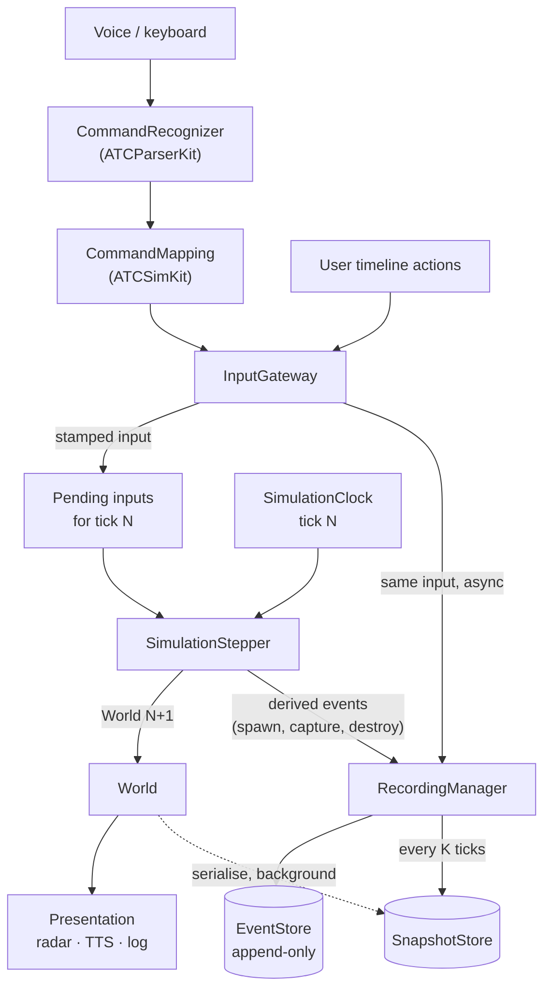
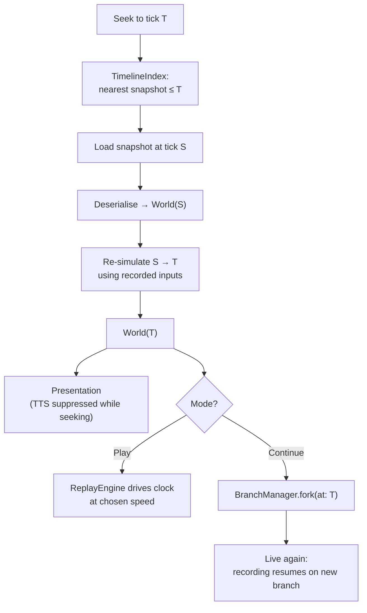
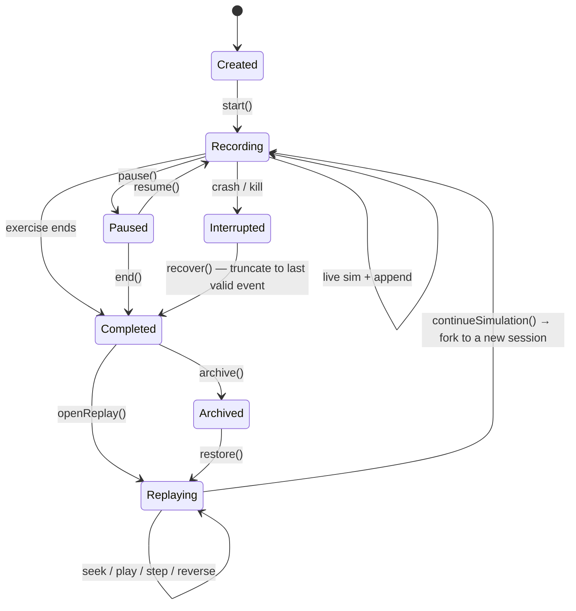

# Simulation Recording, Replay & Timeline Engine — Architecture

**Status:** proposal, for review. No code written.
**Author:** architect
**Date:** 2026-08-03

---

## 0. The short version

I am recommending something narrower than what the brief asks for, and it is narrower on
purpose.

The brief lists aircraft **position, altitude, heading, speed and vertical speed** among the
things that "must be recorded". **We should record none of them.** They are outputs of the
simulation, not inputs to it, and recording outputs is what turns a replay engine into an
expensive video recorder that happens to store numbers instead of pixels.

What we record instead is **causes**: the seed, the configuration, and the sparse stream of
discrete decisions — a command issued, an aircraft spawned, a hold captured. Replay then
**re-runs the simulation** from those causes and arrives at the same positions. Snapshots exist
only to avoid re-running from tick 0, and they are a *cache* — derived, disposable, rebuildable.

This matters for three reasons, in descending order of importance:

1. **It is the only model in which "Continue Simulation" is coherent.** If replay is playback of
   recorded positions, then at 18:32 you hold a picture, not a state — you know where every
   aircraft *was*, but not what it was *trying to do*, which internal counters were mid-flight,
   or which pilot owed a report. Going live from a picture means guessing. If replay is
   re-simulation, then at 18:32 you hold the actual live state, because you got there by
   simulating. Continue is not a feature you build; it is a thing you stop preventing.
2. **Branching becomes free.** A branch is a parent session id, a fork tick, and a new input
   stream. Nothing is copied.
3. **The data is ~2–3 orders of magnitude smaller.** Numbers in §12.

The cost of this model is a single hard requirement: **the simulation must be deterministic.**
That is the real work of this project, and §14 is the longest section for that reason.

The good news — and this is what makes the whole design viable — is that **this simulator is
already 80% of the way there** without anyone having planned for it.

---

## 1. What the existing code already gives us

I went through the live loop before designing anything. These are findings, not assumptions.

### 1.1 The simulation is already a fixed-step integer-tick loop ✅

`MapViewModel.tick()` → `advanceStep()` advances **exactly one simulated second**, always.
`tickInterval = 1.0`. The `simulationSpeed` multiplier (1×…30×) changes only how often the
`Timer` fires — never the step size. The existing comment says so explicitly: *"Fires every
`tickInterval / speed` real seconds and advances exactly one sim-second, so the clock counts up
smoothly (fast, but without skipping numbers)."*

This is the single most valuable property for replay, and most projects have to retrofit it at
enormous cost. Here it exists because someone wanted a smooth clock. Consequences:

- Simulated time is **`tick × 1s`**, an integer. There is no variable delta, no accumulator
  drift, no frame-rate dependence.
- 40 minutes = **2,400 ticks**. A full 40-minute re-simulation is 2,400 iterations of
  `advanceStep()`. That is not a "long replay" — it is milliseconds of work.
- "Frame stepping" is already well-defined: one frame = one tick = one second.

### 1.2 The command path is already event-shaped ✅

```
transcript → CommandRecognizer → RecognizedCommand → CommandMapping → [AircraftCommand]
                                                                          ↓
                                                              MapViewModel.applyCommands
```

`AircraftCommand` is an 18-case value-type enum. It is *already* the ideal recorded event: small,
discrete, causal, and the single funnel through which both speech and the keyboard reach the
simulation. Recording at this boundary captures controller intent exactly once, in one place.

### 1.3 Aircraft state is small and value-typed ✅

`Aircraft` is a `struct` of ~35 scalar fields — position, heading, speed, altitude, their
targets, and a handful of mode flags (`holdingName`, `interceptRunway`, `takeoffState`,
`pendingTakeoffRunway`). A snapshot of one aircraft is on the order of **250 bytes**. Even 200
aircraft is ~50 KB before compression.

### 1.4 Physics is a pure-ish function ✅

`AircraftPhysics.stepPhysics(_ aircraft: inout Aircraft, dt: Double)` takes state and a delta and
mutates state. No hidden clock, no I/O. The guidance services (`LocalizerGuidanceService`,
`HoldingController`, `DirectRouteController`, `SequencingSeparationService`) follow the same
shape. This is why re-simulation is cheap and testable.

### 1.5 The blockers — all four are small, and all four are real ❌

These must be fixed before anything else. They are not design risks; they are present-tense bugs
with respect to replay.

| # | Finding | Why it blocks replay |
|---|---|---|
| **B1** | `Aircraft.id` is declared `public let id = UUID()` — a fresh UUID on every init, with no way to supply one | **Identity cannot survive a restore.** Deserialise a snapshot and every aircraft gets a *new* id, so `selectedAircraftID`, `destroyedAircraftIDs`, the conflict sets, and `PendingReportTracker`'s reports all point at aircraft that no longer exist. This is the hardest blocker and the smallest fix: `public let id: UUID` plus an init parameter defaulting to `UUID()`. |
| **B2** | ~13 direct calls to `Double.random(in:)`, `Int.random(in:)`, `Bool.random()`, `.randomElement()`, `.shuffled()` — concentrated in `AircraftSpawner` (11) and `MapViewModel.promoteFromHangar` (2) | Unseeded global RNG. Two runs of the same session produce different traffic. |
| **B3** | `MapViewModel.destroy(_:)` schedules removal with `DispatchQueue.main.asyncAfter(deadline: .now() + 1.5)` | **A wall-clock timer with a simulation-visible effect.** At 30× speed it fires 45 sim-seconds late; paused, it fires anyway; during replay it fires against the wrong timeline. Wreckage removal must be tick-scheduled. |
| **B4** | `Aircraft` is not `Codable`, nor are `Runway`, `Fix`, `TakeoffState`, `PendingReport` | Nothing can be serialised yet. Mechanical, but it is a real chunk of work and it must be done deliberately (see §11.4 on schema stability). |

`Aircraft` also carries `history: [CLLocationCoordinate2D]` — up to 500 trail points, ~8 KB per
aircraft, which **dwarfs the other 35 fields combined**. It is purely derived from past positions
and must never be snapshotted (§6.3).

**One asset worth calling out:** `ATCTrafficKit.IntervalChooser` already exists — spawn intervals
come in through an injected chooser (`.random`, `.fixed`, `.shortest`) rather than being drawn
inline, specifically so the schedule can be tested deterministically. That is exactly the pattern
B2 needs, already proven in this codebase. We are extending an existing idea, not importing one.

---

## 2. Overall architecture

Three layers, and the boundary between them is the whole design.

```
┌──────────────────────────────────────────────────────────────────────┐
│  PRESENTATION            (excluded from determinism, by design)       │
│  radar rendering · TTS readbacks · feedback log · UI · analytics      │
│  Reads simulation state. Never advances it. May be muted or skipped.  │
└──────────────────────────────────────────────────────────────────────┘
                                   ▲ observes
┌──────────────────────────────────────────────────────────────────────┐
│  SIMULATION CORE                    (must be 100% deterministic)      │
│  SimulationClock · World state · physics · guidance · spawner ·       │
│  collision · reports · scoring                                        │
│  A pure function:  step(state, inputs, rng) → state'                  │
└──────────────────────────────────────────────────────────────────────┘
                                   ▲ inputs        ▼ state
┌──────────────────────────────────────────────────────────────────────┐
│  TIMELINE                        (records causes, restores state)     │
│  EventStore · SnapshotStore · SessionStore · ReplayEngine ·           │
│  TimelineIndex · BranchManager                                        │
└──────────────────────────────────────────────────────────────────────┘
```

The **single most important rule in this document**:

> **Nothing in the Presentation layer may influence the Simulation Core.**

TTS is the concrete case. Speech is wall-clock, asynchronous, interruptible, and device-dependent.
If the simulation ever waits on a readback, or if a readback's completion changes state, the
simulation stops being deterministic and replay stops being possible. So: the *decision* to speak
is recorded (as text + tick); the *act* of speaking is a presentation event that replay may
render, mute, or skip entirely. The `DeferredReportCoordinator` must announce **because a tick
said so**, never announce and then let the audio decide what happens next.

### 2.1 Component ownership

| Component | Owns | Explicitly does **not** own |
|---|---|---|
| **SimulationClock** | The tick counter. The only source of simulated time. Pause/resume/speed. | Wall-clock time. It never reads `Date()`. |
| **World** | All simulation state: aircraft, traffic, weather, mission, scoring, pending reports, RNG streams. One serialisable aggregate. | Rendering, persistence, UI selection. |
| **SimulationStepper** | `step(World, [Input]) → World`. Calls physics and the guidance services in a fixed order. | Deciding *when* to step, or where inputs came from. |
| **InputGateway** | The single funnel every external cause passes through — commands, user timeline actions, injected events. Assigns each an ordinal. | Interpreting inputs. It stamps and forwards. |
| **RecordingManager** | Observes the gateway and the stepper; appends to the EventStore; requests snapshots. Off the hot path. | Deciding what is true. It only writes down what happened. |
| **EventStore** | Append-only, ordered, durable input log per session. | Snapshots, state, replay policy. |
| **SnapshotStore** | Keyframes: `tick → serialised World`. A **cache**. | Being authoritative. It may be deleted at any time. |
| **TimelineIndex** | Fast lookup: tick → nearest snapshot, tick → event range, event search, bookmarks. | Storage. It is a derived index. |
| **ReplayEngine** | Seek, play, pause, speed, step, reverse. Drives the stepper from recorded input instead of live input. | Recording. In replay, recording is off. |
| **SessionManager** | Session lifecycle and identity. Parent/child relationships. | Timeline mechanics. |
| **BranchManager** | Forking a session at a tick. | Copying state (there is none to copy). |

Note what is **absent** from this list: there is no `StateSerializer` as a top-level component
with authority. Serialisation is a capability of `World` (§11.4), not a service that reaches into
it. A serializer that knows the shape of every subsystem becomes the most-edited file in the
project and the place every schema bug lives.

---

## 3. Data flow

### 3.1 Live recording



Two things to notice. First, `RecordingManager` is a **passive observer** — it is fed, it never
gates. A stalled write must never stall the simulation. Second, derived events (a hold captured, a
conflict destroyed) are recorded **as annotations, not as causes**. They are re-derivable by
re-simulation; we record them so the timeline can be searched and scrubbed without replaying, and
so a divergence can be localised (§14.6). If we ever had to choose between an annotation and
correctness, the annotation loses.

### 3.2 Replay and seek



`Continue Simulation` is one line in this diagram, and that is the point. There is no state
reconstruction step, no "hydrate from picture" phase. `World(T)` obtained by re-simulation **is**
a live world. The only thing that changes is which store new inputs are appended to.

---

## 4. Recording: what is an event, what is state, what is a snapshot, what is nothing

This is the section the brief most needs answered, so it is answered as a decision table.

### 4.1 Events — recorded, authoritative, tiny

An event is a **cause the simulation could not have derived on its own**. If the stepper can work
it out, it is not an event.

| Category | Events | Why authoritative |
|---|---|---|
| **Session** | `sessionStarted(seed, exerciseConfig, buildVersion, schemaVersion)` | The entire simulation is a function of this plus the input stream. |
| **Controller** | `commandIssued(tick, callsign, code, slots, source: .voice \| .keyboard)` | Human intent. Unknowable. |
| | `transcriptReceived(tick, raw, normalized)` | Recorded for audit and for parser regression work — *not* an input to the sim. |
| | `commandRejected(tick, reason)`, `handoff`, `frequencyChange` | |
| **Weather** | `weatherChanged(tick, wind, visibility, qnh)` | External input if driven by a script or instructor; **derived** if driven by the seed. Both supported; the event says which. |
| **Instructor** | `eventInjected`, `aircraftForced`, `annotation`, `bookmark` | |
| **Mission** | `missionStarted`, `objectiveDefined` | Configuration, not outcome. |
| **User timeline** | `paused`, `resumed`, `speedChanged`, `seeked`, `branchForked` | Needed to reproduce the *session*, and separately useful for analytics ("trainee paused 14 times"). Kept in a distinct stream so they never affect simulation state. |

**Volume:** a busy 40-minute exercise is perhaps 300–600 commands and a few hundred other
events. Under **1,000 events**, at ~60–120 bytes each ⇒ **~100 KB**. This is nothing.

### 4.2 State — held in `World`, never streamed

Everything the stepper mutates: aircraft, traffic lists, pending reports, mission progress, score,
RNG stream positions, spawn countdowns. It lives in memory and reaches storage **only** via
snapshots.

### 4.3 Snapshots — a derived cache

`tick → serialised World`. Their only job is to make seek fast. Details in §6.

They are **not the source of truth.** Delete every snapshot and the session still replays
perfectly, just more slowly. This is a deliberate and load-bearing property: it means snapshot
interval, compression and format are *performance* knobs, tunable later without a migration, and
a corrupt snapshot is a cache miss rather than data loss.

### 4.4 Never stored

| Not stored | Because |
|---|---|
| **Per-tick position / heading / altitude / speed / vertical speed** | Outputs. Re-derived by `stepPhysics`. Recording them is the video-recorder mistake — see §12.1 for what it would cost. |
| `Aircraft.history` (trail) | Derived from past positions; ~8 KB/aircraft, larger than all its other state. Rebuilt on seek, or rendered from re-simulation. |
| Conflict / warning ID sets | Pure functions of positions, recomputed every tick by `AircraftCollisionDetector`. |
| Rendered readback audio | Presentation. Text + tick is enough. |
| Cosmetic UI state — zoom, pan, layer toggles, selection, menus | No simulation effect. *(Optionally recorded to a separate, ignorable "view track" so an instructor replay can restore the camera. Never in the sim stream.)* |
| Score, computed | Derived from events (§4.5). |

### 4.5 The one deliberate exception: scoring

Score is a pure function of the event stream, so by the rule above it should be derived. But a
score is also a *record about a person*, and if the scoring rules change in v2, re-deriving a v1
session silently rewrites a trainee's result.

So: **derive for display, record for audit.** Write `scoreEvaluated(tick, value, rulesVersion)`
into the event stream as a non-authoritative annotation. Replay recomputes; if the recomputed
value disagrees with the recorded one, the UI shows the recorded score and flags the mismatch.
Never silently prefer one.

---

## 5. Event architecture

### 5.1 Is Event Sourcing the right choice? Partly — and the distinction matters

**Yes** for inputs: an append-only, ordered, immutable log of causes, from which state is a
projection. That is textbook event sourcing and it is exactly right here.

**No** for state changes. Classic event sourcing in business systems records every state
transition, because there is no cheap function that recomputes state from causes — the causes
*are* the transitions. A simulator is the opposite: it **owns** the function that turns causes
into state (`step`), and that function is fast and total. So state-change events would be
redundant, enormous, and — worse — they create a second version of the truth that can disagree
with the simulation.

The accurate name for what I am proposing is **deterministic input recording with keyframes** —
the model used by RTS games, competitive fighting games, and professional flight sim replay. Event
sourcing is the storage layer; deterministic re-simulation is the projection.

The practical test of the difference: *if the physics gets a bug fix, what happens to old
sessions?* Under state-change sourcing, they replay with the old bug frozen in and the fix is
invisible. Under input recording, they replay with the fix — the recorded causes are unchanged and
the consequences are recomputed. For a **training** product that is the behaviour we want, and
§14.6's hash lets us *detect* that a replay diverged from its original rather than pretend it did
not.

### 5.2 Event identity, ordering and schema

Ordering is the part people get wrong, so it is explicit:

```
EventID = (sessionID, ordinal)          // ordinal: monotonic UInt32 within a session
SortKey = (tick, ordinal)               // the total order; tick alone is NOT unique
```

Several inputs can arrive within one tick (a multi-command transmission is the common case —
"climb FL260, speed 300, turn right 250" is three commands at one tick). **`tick` is not a unique
key and must never be used as one.** The `(tick, ordinal)` pair gives a stable total order, and
`ordinal` is assigned by `InputGateway` — the single funnel — so it is naturally gap-free and
race-free.

```
Event
  ordinal      UInt32          assigned by InputGateway, monotonic
  tick         UInt32          simulated time; ~4.3 billion ticks ≈ 136 years, ample
  wallClock    UInt64?         real time, for audit only — NEVER read by the simulation
  kind         UInt16          discriminator
  actor        ActorRef?       aircraft id / mission id / nil
  payload      bytes           kind-specific, versioned
```

`wallClock` is stored and deliberately quarantined: it answers "how long did the trainee take to
respond" (a genuine analytics question) while being structurally incapable of affecting replay.
The rule is enforceable in review: *no code inside the Simulation Core may read `wallClock`.*

### 5.3 Versioning

Events are immutable and outlive the code that wrote them, so:

- Every session header carries `schemaVersion` and `buildVersion`.
- Payloads are **additively evolvable**: new optional fields only. Never renumber a `kind`, never
  repurpose a field. A retired `kind` stays retired.
- **Upcasting on read**: a chain of `migrate(vN → vN+1)` functions runs at load, so the rest of
  the system only ever sees the current shape. This is the same pattern as
  `TemplateSet.applying(_:)` — fix the data at the boundary, keep the core clean.
- A session whose `schemaVersion` exceeds what this build understands is **refused with a clear
  message**, not opened optimistically. Half-reading a future format is how you corrupt it.

### 5.4 Event bus

The existing code has no bus and does not need one. Adding a general pub/sub bus here would be a
mistake: it makes ordering emergent rather than declared, and ordering is the one thing that must
be certain.

Instead: `InputGateway` is a plain object with an explicit, ordered list of observers
(`RecordingManager`, then the simulation queue). Deterministic, debuggable, no dispatch layer.
"Event bus" as an abstraction can arrive later if multiplayer needs it — and if it does, its
ordering guarantees will have to be at least this strong anyway.

---

## 6. Snapshot architecture

### 6.1 Interval — derived from a latency budget, not guessed

The brief asks for the right interval. The honest answer: **it falls out of one measurement we
have not taken yet**, so the design makes it a tunable with a defensible starting value.

Let `C` = cost of one `advanceStep()`. Worst-case seek cost ≈ snapshot load + `K × C` where `K` is
the interval in ticks.

From the shape of `advanceStep()` — one pass of guidance + physics per aircraft, plus O(n²)
pairwise collision — with 50 aircraft I estimate `C` in the tens of microseconds. Even at a
pessimistic **1 ms**, `K = 300` gives a 300 ms worst-case seek. That is at the edge of feeling
instant.

**Recommendation: `K = 60` ticks (one snapshot per simulated minute).**

- Worst-case re-simulation: 60 steps — imperceptible even at pessimistic `C`.
- A 40-minute session: **40 snapshots**. At ~50 KB each uncompressed for 200 aircraft, ~2 MB;
  compressed (§6.4), a few hundred KB. Negligible.
- One snapshot per minute aligns with how instructors actually talk about a session ("at minute
  fourteen"), which makes the timeline UI honest about its granularity.

Then **measure `C` and adapt.** Two refinements, in order of value:

1. **Adaptive interval** — snapshot on a *cost* budget rather than a tick count: after each
   snapshot, accumulate estimated step cost and snapshot again when it exceeds the seek budget
   (say 100 ms). Sessions with 8 aircraft get sparse snapshots; sessions with 200 get dense ones.
   Self-tuning, no magic number.
2. **Event-anchored snapshots** — additionally snapshot immediately before a *significant*
   event (mission trigger, first conflict, go-around). These are the points an instructor
   actually scrubs to, so make those seeks free. Cheap to add; high perceived value.

### 6.2 Contents

The **complete** `World`, and nothing outside it:

- Clock: `tick`.
- All aircraft (radar + hangar/traffic), each with its full state **minus `history`**.
- `PendingReportTracker` state — the reports pilots owe. Easy to forget and immediately visible
  when wrong: an aircraft that stops owing its "report passing" report is an obvious bug.
- Spawn/traffic state: `TrafficSchedule` countdowns, `RadarPromotionSchedule`, capacity.
- **RNG stream positions** (§14.2). Non-negotiable — a snapshot without them is not a resumable
  state, and this is the single easiest thing to omit by accident.
- Mission progress, active triggers, score, timers.
- Weather.
- `destroyedAircraftIDs` **plus the tick each is due for removal** (once B3 is fixed).

### 6.3 What snapshots exclude, and how the trail comes back

`Aircraft.history` is excluded — it is the largest field and fully derived. On seek, the trail is
rebuilt during the re-simulation from snapshot to target, which naturally regenerates up to `K`
points. For a full-length trail after a seek, re-simulate from one snapshot earlier. This is a
presentation concern and should be lazy: rebuild the trail only for aircraft actually on screen.

### 6.4 Incremental vs full snapshots

**Recommendation: full snapshots. Do not build incremental snapshots.**

The case for incremental (store only fields that changed) looks attractive and is a trap here:

- A snapshot chain means a corrupt link invalidates everything after it — turning a cache miss
  into cascading data loss, and destroying the "snapshots are disposable" property that §4.3
  depends on.
- Restoring requires walking and applying the chain, which is *the same work as re-simulating*
  but with more code and no correctness benefit. We already have a fast, tested way to advance
  state: `advanceStep()`.
- The saving is illusory. Full snapshots at `K = 60` are already a few hundred KB per session.
  Optimising that is optimising the wrong order of magnitude.

**Delta recording already exists in this design** — it is the event stream. Adding a second delta
mechanism is duplicated machinery for the same purpose.

### 6.5 Serialisation and compression

Snapshots are **not** a public contract (they are a cache), which buys real freedom: they may use
a compact format, and a version mismatch simply invalidates them.

- Format: deterministic binary — fixed field order, little-endian, `Float64` for geodetic
  positions (`Float32` loses ~1 m of precision, unacceptable for a 1 NM capture radius).
- Compression: field-order layout groups like-typed values, then **LZFSE** (Apple-native, fast,
  in `Compression.framework`, no dependency). Expect 3–5× on this kind of numeric data.
- **The escape hatch that makes this safe:** stamp each snapshot with `schemaVersion` +
  `buildVersion`. On mismatch, **discard and re-derive from events**. Snapshots never need a
  migration path — which is precisely why they are allowed a compact, brittle format while events
  are not.

---

## 7. Timeline architecture

`TimelineIndex` is a derived, rebuildable index over one session's stores:

```
snapshotTicks   [UInt32]                    sorted; binary search for nearest ≤ T
eventOffsets    [(tick, ordinal, offset)]   sorted; range queries by tick
significant     [(tick, kind, label)]        conflicts, missions, go-arounds — timeline markers
bookmarks       [(tick, label, note)]        instructor annotations (§18 future work)
```

### 7.1 Seek

```
seek(to: T):
    if T == current.tick                        → done
    if T > current.tick and (T - current.tick) < replayThreshold
                                                → step forward (T - current.tick) times
    else
        S = snapshotTicks.lastIndex(where: ≤ T)
        World = SnapshotStore.load(S)           (on miss: fall back to an earlier snapshot,
                                                 or tick 0 + full re-simulation)
        replay events in (S, T] through the stepper
```

`replayThreshold` exists because forward-stepping a few ticks beats a snapshot load and
deserialise. `K/2 = 30` is a sensible start; it is a tunable, not a constant of nature.

Worst case is bounded by `K` **by construction**. Not "usually fast" — *bounded*. That is the
property that lets the UI promise instant scrubbing.

### 7.2 Scrubbing

While the user drags the scrubber, we must not run a full seek per pixel. Two rules:

- **Coalesce**: only the latest scrub target matters; drop superseded ones. During the drag, seek
  to **snapshot boundaries only** (a load, no re-simulation), then do the exact seek on release.
  Scrubbing feels continuous while doing far less work.
- **Suppress presentation side-effects while seeking.** No TTS, no feedback-log entries, no score
  animation. A seek through 200 ticks must not queue 40 readbacks. This wants to be structural —
  a `isSeeking` flag the presentation layer honours — not remembered per call site.

### 7.3 Frame stepping

`stepForward()` = `seek(tick + 1)` = one `advanceStep()`. Exact and cheap.

`stepBackward()` = `seek(tick - 1)`. Costs a snapshot load plus up to `K-1` steps. At `K = 60`
that is fine for occasional use; for *sustained* backward stepping, keep a small ring buffer of
recent Worlds (§8.2).

---

## 8. Reverse playback

The brief is right that playing events backwards is wrong, and the reason is worth stating
precisely: **this simulation is not invertible.** Collision destruction, spawning, holding capture
and landing removal all destroy information. There is no `unstep`, and writing one would mean
maintaining a second physics implementation that must agree with the first — the worst kind of
duplication.

**Reverse playback = repeated seek, with a cache.**

### 8.1 Reverse play

To play backwards from `T` at 1×:

1. Load the snapshot at `S = nearest(≤ T)`.
2. Re-simulate `S → T`, **retaining each intermediate World in a ring buffer**.
3. Play the buffer backwards, one entry per frame.
4. On reaching `S`, repeat for the previous snapshot interval.

The insight: reverse play needs the *same* `K` states forward play would compute, just consumed in
reverse. Compute them once, forward, and read the buffer backwards. Cost is one snapshot load per
`K` ticks — the same as forward play — with a bounded memory cost.

### 8.2 Ring buffer sizing

`K = 60` Worlds × 50 KB (200 aircraft) = **~3 MB**. With 20 aircraft, well under 1 MB. Acceptable,
and it can hold `K/2` and reload more often if memory is tight.

This buffer also makes sustained backward frame-stepping free, since the states are already there.

### 8.3 What reverse deliberately does not do

Reverse playback does **not** re-fire presentation events. Readbacks are not played backwards;
score does not un-animate. Reverse is a state-inspection tool, and pretending otherwise produces
nonsense audio.

---

## 9. Branching architecture

This is where the input-recording model pays for itself.

```
Session A (root)              tick 0 ──────────────────────────── 2400
                                          │ fork at tick 900
Session B (child of A @ 900)              └──── 900 ─────── 2100
                                                    │ fork at tick 1500
Session C (child of B @ 1500)                       └──── 1500 ──── 1800
```

### 9.1 A branch is metadata plus a new stream

```
Session
  id             SessionID
  parentID       SessionID?        nil for a root
  forkTick       UInt32?           nil for a root
  seed           UInt64            inherited from the root — the whole lineage shares it
  exerciseConfig ...               inherited
  createdAt, label, state
```

Forking at tick `T`:

1. Seek to `T` (§7.1) — we already hold `World(T)`.
2. Create session `B` with `parentID = A`, `forkTick = T`.
3. Write `B`'s first snapshot **at tick `T`** from the in-memory World. This is the one place a
   snapshot is written eagerly, and it makes `B` self-sufficient: `B` never needs to read `A`'s
   snapshots.
4. Resume live. New inputs append to `B`'s event store.

**Nothing is copied.** No state duplication, no event copying. A branch costs one snapshot
(~50 KB) plus a row.

### 9.2 Replaying a branch

Two equally valid strategies, and the choice is a real trade-off:

- **Self-sufficient (recommended):** `B` holds its own fork snapshot, so replaying `B` from its
  start needs only `B`. Costs one snapshot. Archival, export and cloud sync all become trivially
  simple because a session is a closed unit.
- **Lineage-walking:** `B` stores no fork snapshot; replaying `B` at tick `X > T` means replaying
  `A` from 0 to `T`, then `B` from `T` to `X`. Saves 50 KB, costs a recursive replay whose depth
  grows with branch depth, and couples `B`'s integrity to `A`'s.

Take self-sufficiency. 50 KB is not worth a recursive dependency between sessions — especially
once cloud sync exists and a parent might not be present locally.

### 9.3 The parent's future is not deleted

The brief says "the previous future should no longer be considered active." Agreed on *active* —
and it must not be *destroyed*. `A`'s events after tick 900 remain, intact and replayable. That is
the entire value of branching for training: comparing what the trainee did the first time against
what they did the second. Deleting the original future would throw away the comparison the feature
exists to enable.

`A` is marked `.superseded(by: B, at: 900)` for UI purposes; the data is untouched.

---

## 10. Session lifecycle



`Replaying → Recording` is the "Continue Simulation" transition, and it always **forks**. It never
mutates the session being replayed. That invariant is what makes replay safe to hand to a trainee:
nothing they do while exploring can damage the record of what they did.

---

## 11. Storage strategy

### 11.1 Options compared

| Option | Size | Random access | Crash safety | Schema evolution | Verdict |
|---|---|---|---|---|---|
| **JSON** | 5–10× binary | Poor (parse all) | Poor (truncation ⇒ invalid document) | Excellent | **No** for events/snapshots. Yes for the session manifest, where debuggability wins and size is irrelevant. |
| **SQLite** | Good | Excellent (indexed) | **Excellent** (WAL, atomic commits) | Good (`ALTER`, migrations) | **Yes** — for the session catalogue and the timeline index. Battle-tested, on-device, one file, transactional. |
| **Custom binary, append-only** | **Best** | Good with an index | **Excellent** if framed with lengths + checksums | Manual (needs discipline) | **Yes** — for the event log and snapshot blobs. |
| **Protobuf** | Very good | Good | Good | **Excellent** (field numbers, native back/forward compat) | **Not phase 1.** Adds a codegen toolchain and a dependency for a problem we do not have yet. The right migration target if the format ever leaves the device. |
| **FlatBuffers** | Very good | **Excellent** (zero-copy) | Good | Good | **No.** Zero-copy matters when you read huge buffers per frame; our snapshots are tens of KB read on seek. Cost without benefit. |

### 11.2 Recommendation: SQLite as the spine, binary blobs for bulk

```
sessions/
  catalogue.sqlite                  sessions, lineage, timeline index, bookmarks
  <sessionID>/
    manifest.json                   seed, config, schema + build version — human-readable on purpose
    events.log                      append-only framed binary
    snapshots/
      000060.snap                    LZFSE-compressed World
      000120.snap
```

Why this split rather than everything in SQLite:

- **The event log wants to be append-only**, and an append-only file with length-prefixed,
  checksummed frames is the most crash-resistant structure available. Recovery is "read forward
  until a frame fails to validate, truncate there" — no repair tooling.
- **SQLite gives indexing and transactions** where we need queries: list sessions, walk lineage,
  search events, resolve bookmarks.
- **Snapshots as individual files** are trivially evictable and archivable. Deleting one is `rm`;
  in a blob table it is a `VACUUM` conversation.
- **`manifest.json` is deliberately human-readable.** When a session will not open, the first
  question is always "what seed and build was this?", and it should be answerable with `cat`.

### 11.3 Chunking, lazy loading, archival

- **Chunk** `events.log` at a fixed size (~1 MB) so a long session need not be memory-mapped
  whole. The index records chunk offsets.
- **Lazy load**: only the event range and the one snapshot a seek needs. Never load a whole
  session.
- **Archive**: `.vectrasession` = the session directory, compressed. Self-sufficient (§9.2), so it
  moves to iCloud/S3 as a unit. Optionally drop all snapshots on archive — they rebuild on demand,
  usually shrinking the archive by more than half.

### 11.4 Making `World` serialisable without a god-object

Blocker B4 says nothing is `Codable` yet. How we fix that determines whether this system is
maintainable in two years.

**Rejected:** one `StateSerializer` that knows every subsystem's fields. It becomes the
most-edited file in the repo, every new field is a merge conflict, and forgetting to add a field
there is a silent bug — exactly the "built but never wired" failure mode this codebase has been
bitten by repeatedly.

**Recommended:** each subsystem owns its own serialisation, and `World` is the composition.
`Aircraft` conforms to `Codable` in ATCSimKit next to its definition; `TrafficSchedule` in
ATCTrafficKit; and so on. Then one **completeness test** asserts that a round-tripped `World`
equals the original, plus a reflection-based test that every stored property of `Aircraft` is
covered. Adding a field without persisting it should fail a test, not surface as a mysteriously
resetting aircraft.

This also keeps the packages honest: ATCSimKit stays free of any replay concept, and the timeline
layer depends on the packages rather than reaching into them.

---

## 12. Performance and memory

### 12.1 The number that justifies the whole approach

Per-tick state recording, 200 aircraft, 40 minutes:

```
200 aircraft × ~35 fields × 8 bytes × 2,400 ticks  ≈  134 MB  per session, uncompressed
```

Even at 5× compression that is ~27 MB per session, and it grows linearly with aircraft **and**
duration. Input recording:

```
events    ~1,000 × ~100 B                      ≈  100 KB
snapshots 40 × 50 KB, compressed ~4×           ≈  500 KB
                                                  ─────────
                                                  ~600 KB
```

**~200× smaller**, and the events part does not grow with aircraft count at all. This is not a
micro-optimisation; it is the difference between keeping every session a trainee ever flew on
device and not.

### 12.2 The hot path

Recording must not slow the live simulation. Guarantees:

- The step function does **no I/O**. `RecordingManager` copies the input and returns.
- Appends go to an in-memory buffer, flushed on a serial background queue — batched by count or
  ~1 s of wall time.
- Snapshots serialise a **value-type copy** of `World` handed to a background queue. Because
  `Aircraft` and its friends are structs, this is a cheap copy with no tearing risk. (Swift's CoW
  makes this nearly free until the writer mutates.)
- **Backpressure policy, stated up front:** if the write queue falls behind, *drop snapshots*
  (they are a cache) and **never drop events** (they are the truth). If events cannot be written,
  the session is marked degraded and the user is told. Silent data loss is the one unacceptable
  outcome.

### 12.3 Scaling to hundreds of aircraft

The step cost is dominated by `AircraftCollisionDetector`, which is **O(n²)** pairwise. At n=50
that is 1,225 pairs — fine. At n=400 it is ~80,000 pairs *per tick*, and re-simulating 60 ticks
for a seek becomes ~4.8 M pair checks.

This is a **live-simulation** scaling problem before it is a replay problem, and the fix is the
standard one: a uniform spatial grid or sweep-and-prune over the ~5 NM interaction radius,
reducing it to near-linear. Worth flagging here because replay **amplifies** it: every seek pays
the step cost `K` times. Deferred to Phase 2, with a note that the snapshot interval can be
lowered as a stopgap.

### 12.4 Long sessions

Nothing in the design grows with session length except the event log (linear, tiny) and the
snapshot count (linear, small, evictable). Seek cost is **bounded by `K`**, independent of session
length — a 4-hour session seeks exactly as fast as a 4-minute one. That is the property worth
protecting in every future change.

---

## 13. Threading model

The simulation is currently `@MainActor` (the app target sets
`SWIFT_DEFAULT_ACTOR_ISOLATION = MainActor`), and **I am not proposing to move it.**

Moving a deterministic loop off the main actor buys throughput we do not need and risks the one
property we cannot lose. Single-threaded is not a limitation here; it is a *feature* — it makes
ordering total and reproducible by construction.

| Thread / actor | Work | Why |
|---|---|---|
| **Main actor** | `SimulationClock`, `SimulationStepper`, all `World` mutation, `InputGateway` | Determinism through single-threaded ordering. Also where the UI already observes state. |
| **Serial background queue** (`recording.io`) | Event batching, log appends, `fsync` policy | Keeps I/O off the step path. Serial preserves append order. |
| **Serial background queue** (`recording.snapshot`) | `World` serialisation + LZFSE | Snapshots are the heaviest single operation; a value-type copy makes offloading safe. |
| **Background queue** (`replay.prefetch`) | Speculative snapshot loads while scrubbing | Latency hiding; strictly a cache warmer with no correctness role. |
| **Never** | Anything that mutates `World`, and any `async` inside the step path | An `await` in `step` reintroduces nondeterministic interleaving and undoes the entire design. |

Concurrency rules, in priority order:

1. `World` is mutated on the main actor only. Background work receives **immutable copies**.
2. No `await` inside `step`. If a subsystem needs async work, it must be restructured to request
   the work and consume the answer as a *recorded input* on a later tick.
3. Background failures surface as state on `RecordingManager` — never as a thrown error into the
   step path.

Rule 2 is the one most likely to be violated under future pressure, and it is worth a lint or a
test that fails if `step` becomes `async`.

---

## 14. Deterministic replay — the actual work

Everything above depends on this. Ordered by risk.

### 14.1 Time — one clock, integers only

`SimulationClock` owns `tick: UInt32`. Simulated time is `tick × tickInterval`, integer-derived.

- **No `Date()`, no `CACurrentMediaTime()`, no `DispatchTime` inside the Simulation Core.** Today
  the only violation is `destroy(_:)` (**B3**); it must become "remove wreckage at
  `tick + wreckageDisplayTicks`", checked each step. Once fixed, wreckage timing is identical at
  1× and 30×, paused, and in replay — which is also a *live* bug fix, not only a replay
  requirement.
- The `Timer` keeps driving the live loop; it decides *when* to step, never *how much*. That
  separation already exists and should be documented as load-bearing so nobody "optimises" it into
  a delta-time loop.

### 14.2 Randomness — seeded, split by subsystem

Replace all ~13 direct RNG calls (**B2**) with an injected, seeded generator. Swift's
`RandomNumberGenerator` protocol makes this idiomatic; use a stable algorithm we control
(SplitMix64 or PCG32) — **not** `SystemRandomNumberGenerator`, and **not** `Double.random(in:)`
without an explicit generator.

The non-obvious part, and the one that will otherwise cost a day of debugging:

> **Give each subsystem its own stream, derived from the root seed.**
> `spawner`, `promotion`, `trafficSchedule`, `weather`, `aiDecisions` each get
> `seed(root, streamID)`.

With a single shared stream, adding one extra draw anywhere shifts every subsequent value in every
other subsystem — so a small change to the spawner silently changes the weather in every existing
recording. Split streams make subsystems independent, and their positions are part of the snapshot
(§6.2).

`ATCTrafficKit.IntervalChooser` already demonstrates the pattern; it should take a generator rather
than closing over `.random`.

### 14.3 Iteration order

Two rules, one of which is a latent trap rather than a present bug:

- Aircraft are held in an `Array` and iterated by index — already deterministic. Keep it that way;
  do not switch to a `Dictionary` keyed by id for convenience.
- **`Set` and `Dictionary` iteration order is not stable in Swift** — hashing is seeded per
  process, so order can differ between two runs of the *same binary*. `destroyedAircraftIDs` and
  the conflict sets are currently used only for `contains` and set algebra, so nothing is broken
  today. But the moment a decision iterates a `Set`, replay breaks in a way that is maddening to
  diagnose. **Rule: never let `Set`/`Dictionary` iteration order affect simulation state — sort
  first.** Worth a review checklist item.

### 14.4 Floating point

Same binary + same architecture ⇒ IEEE-754 double arithmetic is bit-reproducible. Within one
device this is safe. Risks:

- **Cross-architecture** (arm64 device vs x86_64 simulator, or a future Android port) can differ,
  especially in transcendental functions (`sin`, `cos`, `atan2`) — which GeoNavKit uses heavily for
  great-circle work. A recording made on a device may not re-simulate bit-identically in the
  simulator.
- **`-ffast-math` / aggressive optimisation** may reassociate operations. Do not enable fast-math
  for ATCSimKit or GeoNavKit.

Mitigation, in order:

1. Accept per-architecture determinism for Phase 1. Record `architecture` in the manifest.
2. Detect divergence rather than hope (§14.6) — the difference between a wrong replay and a
   *flagged* one.
3. Only if cross-platform replay becomes a product requirement: move the integration to
   fixed-point or a soft-float geodesy path. **Do not do this speculatively** — it is a large,
   invasive change and it may never be needed.

### 14.5 Async and external systems

- **TTS/speech:** decisions recorded, audio never awaited (§2).
- **Networking:** the exercise payload is fetched *before* the session and stored in the manifest.
  The simulation never fetches mid-run. If a future feature needs live data, it enters as a
  recorded input, not a direct call.
- **`DispatchQueue.main.asyncAfter`:** banned in the Simulation Core (B3). The other use, in
  `CommandFeedbackManager` (an 8-second UI dismissal), is pure presentation and is fine.

### 14.6 Divergence detection — do not trust, verify

Determinism is an invariant, and invariants that are not checked decay. So:

- Every `H` ticks (say 60), compute a cheap **state hash** — positions, headings, altitudes,
  speeds, aircraft count, quantised to a tolerance — and store it with the snapshot.
- During replay, recompute and compare. On mismatch: **log the tick, then re-anchor from the
  nearest snapshot and continue.** Replay stays visually correct while the divergence is recorded.
- Surface a "replay diverged at 14:03" indicator instead of silently showing a plausible lie.

This single mechanism converts determinism from a hope into a monitored property, and it is the
thing that will actually keep this system honest as the simulator grows. It also gives us a
regression test with real teeth: **record a session, replay it, assert every hash matches.**

---

## 15. Crash recovery

The event log's design does the work here.

**During recording:**

- Frames are length-prefixed with a CRC32. A crash mid-write leaves a partial final frame,
  detectable and discardable — the log up to that point is fully valid.
- Flush cadence trades durability against I/O: batching ~1 s of events risks losing ~1 s of input
  on a hard kill. Acceptable, and tunable per deployment (an assessment session might `fsync`
  every event).
- The manifest is written **at session start**, so a crashed session is always identifiable.

**On next launch:**

1. Any session in state `Recording` was interrupted.
2. Read `events.log` forward, validating frames; truncate at the first bad one.
3. Discard snapshots with a tick beyond the last valid event (they may describe a future that no
   longer has causes).
4. Mark the session `Completed (recovered, truncated at tick N)` — honestly labelled, never
   silently.

**Can recording resume?** Yes, and it should be a **fork** (§9), not an in-place append. The
process that would append is gone, its in-memory `World` with it; resuming means seeking to tick
`N` and continuing — which is exactly Continue Simulation. Reusing that path means one
well-tested mechanism instead of two.

**Can corrupt sessions be repaired?** Partially, and the layering says how far:

- Corrupt **snapshot** → cache miss. Delete it; rebuild from events. **Full recovery.**
- Truncated **event log** → the session is intact up to the truncation. **Partial recovery**, with
  everything before it perfectly replayable.
- Corrupt **manifest** (seed/config lost) → **unrecoverable**, because the seed is the root of the
  whole reconstruction. Which is why the manifest is small, written once, never mutated, and worth
  writing twice (a `.bak` alongside it).

---

## 16. Risks and edge cases

| # | Risk / edge case | Severity | Handling |
|---|---|---|---|
| R1 | `Aircraft.id` not restorable (**B1**) | **Blocker** | Make `id` an init parameter. First task, before anything else. |
| R2 | A field added to `Aircraft` but not to serialisation | **High** — silent, resets state on seek | Round-trip + reflection completeness test (§11.4). Fails the build, not the user. |
| R3 | Determinism decays as features land | **High** | Hash verification in CI on recorded fixture sessions (§14.6). A new feature that breaks replay fails a test. |
| R4 | Cross-architecture float divergence | Medium | Record architecture; detect and re-anchor. Fixed-point only if it becomes a requirement. |
| R5 | O(n²) collision at hundreds of aircraft, amplified `K×` per seek | Medium | Spatial partitioning (Phase 2). Interim: lower `K`. |
| R6 | Seek storms during scrubbing | Medium | Coalesce; snapshot-boundary-only during drag (§7.2). |
| R7 | TTS queue flooded by a seek | Medium | Structural `isSeeking` suppression, not per-call-site discipline. |
| R8 | Branch depth → recursive replay | Low | Self-sufficient branches (§9.2). |
| R9 | Session mid-tick at fork (multi-command transmission) | Medium | Fork only on tick boundaries; `(tick, ordinal)` makes "all inputs for tick T" unambiguous. |
| R10 | Clock drift under speed change | Low | Already correct: speed changes timer period, never step size. Protect with a test. |
| R11 | Storage growth across many sessions | Low | Snapshot eviction (rebuildable), archival, a device budget with oldest-first eviction of *archived* sessions. |
| R12 | Replaying a session from a newer build | Medium | Refuse with a clear message on `schemaVersion >` known; upcast on `<` (§5.3). |
| R13 | Exercise payload changes on the backend between record and replay | **High** — silently different world | Store the resolved payload **in the manifest**, not a reference to it. Never re-fetch on replay. |
| R14 | Instructor edits during replay | Medium | Any mutation forces a fork. Replay sessions are immutable, full stop. |
| R15 | Wall-clock leaking back into the core | **High** | Ban by review + a test that the step path is synchronous and clock-free. Grep-able rule. |

R13 deserves emphasis because it is the kind of bug that destroys trust in a replay system: if the
fixes, runways or airlines are fetched fresh at replay time and the backend has since changed,
the replay is of a *different world* and every position will be subtly wrong with no error
anywhere. **The payload is part of the recording.**

---

## 17. Trade-offs, stated plainly

| Decision | Gains | Costs | Why the trade is right |
|---|---|---|---|
| Input recording over state recording | ~200× smaller; Continue and branching become trivial; bug fixes propagate | **Requires determinism** — the whole project's risk sits here | Determinism is achievable (§1 shows we are most of the way) and it is the only model where Continue is coherent |
| Full over incremental snapshots | Simple; independently corrupt-tolerant; snapshots stay disposable | Larger — but ~500 KB/session | Optimising 500 KB is not worth cascading corruption |
| Snapshots as cache, not truth | Format/interval/compression become free variables; no snapshot migrations | Must always be able to re-derive from events | Keeps one source of truth. Non-negotiable |
| Single-threaded core | Determinism by construction; simple debugging | No multi-core simulation | The loop is not the bottleneck; determinism is worth more than throughput |
| SQLite + binary blobs | Crash-safe append; indexed queries; evictable snapshots | Two storage mechanisms | Each is used where it is strongest; both are boring and proven |
| Reverse = seek + ring buffer | No inverse physics; correct by construction | ~3 MB buffer at 200 aircraft | An inverse simulation is a second physics implementation that must agree with the first |
| Self-sufficient branches | Simple archival/sync; no recursion | 50 KB per branch | 50 KB against a recursive inter-session dependency |
| Score derived **and** recorded | Rules can improve; trainee results stay auditable | Two values that can disagree | Disagreement is surfaced, not hidden — the honest option |

---

## 18. Alternatives considered and rejected

**A. Full state streaming (per-tick state dump).** Trivially "deterministic" (nothing to
recompute), and dead simple. Rejected: 134 MB/session (§12.1), Continue Simulation reduces to
guessing from a picture, branching means copying, and it cannot benefit from a physics fix. This
is the video recorder the brief explicitly does not want, wearing numbers.

**B. Classic event sourcing with state-change events.** Every mutation is an event. Rejected: it
duplicates a truth the simulator already computes, produces a second state machine that can
disagree with the first, and its volume approaches (A) because position changes every tick.

**C. Command-only recording, no snapshots.** Elegant and minimal. Rejected on seek latency alone:
jumping to 39:00 means 2,340 steps, and scrubbing is unusable. Snapshots are the cheap fix, and
because they are a cache they add no correctness surface.

**D. Hybrid — inputs plus periodic *partial* state as ground truth (positions every 10s).** Looks
like belt-and-braces. Rejected as the worst of both: if the partial state ever disagrees with
re-simulation you have two truths and no rule for choosing, and it *masks* determinism bugs
instead of exposing them, so determinism quietly rots. §14.6's hash gets the same safety net with
no ambiguity — it *detects* rather than *overrides*.

**E. Make the simulation a separate deterministic module with its own thread.** Architecturally
tidy; a real option for a future engine. Rejected now as a large refactor of `MapViewModel` for no
Phase-1 benefit, and the `@MainActor` default already gives us single-threaded ordering for free.

---

## 19. Final recommendation

**Deterministic input recording with cached keyframe snapshots, over an append-only event log,
with fork-based branching.**

Concretely:

1. `SimulationClock` — integer ticks, the only time source.
2. `World` — one serialisable state aggregate, composed of subsystem-owned `Codable` parts.
3. `step(World, [Input]) → World` — synchronous, pure, seeded, single-threaded.
4. `EventStore` — append-only framed binary; the **only** authoritative record.
5. `SnapshotStore` — LZFSE'd full Worlds every 60 ticks; a **disposable cache**.
6. `TimelineIndex` — derived index for seek, search and bookmarks.
7. `ReplayEngine` — seek = nearest snapshot + delta re-simulation; reverse = seek + ring buffer.
8. `BranchManager` — fork = parent id + fork tick + one snapshot.
9. **Hash verification** — determinism monitored, not assumed.

**Justification in one line each:** it is the only model where Continue Simulation is a
non-feature rather than a guess; it is ~200× smaller; seek latency is *bounded* rather than
merely usually-fast; branching costs nothing; and the existing fixed-step loop means we are
extending this codebase's grain rather than fighting it.

**The honest headline risk:** everything rests on determinism, and determinism decays silently.
That is why §14.6 is not optional polish — it is the mechanism that keeps the architecture true
after we stop paying attention to it. If one thing from this document must survive review, it is
the hash check in CI.

---

## 20. Phased roadmap

Each phase ends somewhere shippable. No phase requires rewriting an earlier one.

### Phase 0 — Determinism groundwork *(no replay yet; all four are current bugs)*

**Deliverable:** the live simulator is deterministic and provably so.

1. **B1** — `Aircraft.id` becomes an init parameter.
2. **B2** — seeded, per-subsystem RNG streams; remove all direct `.random` calls;
   `IntervalChooser` takes a generator.
3. **B3** — wreckage removal becomes tick-scheduled; ban wall-clock from the core.
4. Extract `SimulationClock`; make `tick` the sole time source.
5. **Test:** same seed + same inputs ⇒ identical state hash after 2,400 ticks. Run twice in the
   same process and in separate processes (catches hash-seed and iteration-order faults).

*Value even without replay: B3 is a real bug at high speed, and the determinism test will find
others.*

### Phase 1 — MVP: record, replay, seek, continue

**Deliverable:** record a session, scrub it, continue live from any point.

6. **B4** — `Codable` across `World`, subsystem-owned, with the completeness test.
7. `World` aggregate; `step(World, [Input]) → World` extracted from `advanceStep()`.
8. `InputGateway` with `(tick, ordinal)`; route the existing command path through it.
9. `EventStore` — framed append-only log + `manifest.json` (**including the resolved exercise
   payload**, R13).
10. `SnapshotStore` — full snapshots every 60 ticks, LZFSE, background queue.
11. `ReplayEngine` — seek, play, pause, speed, forward frame step.
12. `SessionManager` + `BranchManager` — Continue Simulation via fork.
13. Timeline UI: scrubber, play/pause, speed, event markers.
14. Crash recovery: truncate-and-recover on launch.

*This is the whole brief's core. Everything after is optimisation or reach.*

### Phase 2 — Performance and robustness

15. Reverse playback + ring buffer; backward frame stepping.
16. **Hash verification in CI** over recorded fixture sessions.
17. Adaptive + event-anchored snapshot intervals.
18. Scrub coalescing, prefetch, structural `isSeeking` suppression.
19. Spatial partitioning for collision (O(n²) → near-linear) — unblocks hundreds of aircraft.
20. Chunked event log, snapshot eviction, archive/restore.

### Phase 3 — Advanced

21. Event search, bookmarks, instructor annotations.
22. Session comparison (two branches side by side) — the payoff of §9.3.
23. Analytics and heatmaps derived from the event stream (no new recording needed).
24. Cloud sync + `.vectrasession` export — already trivial thanks to self-sufficiency.
25. Undo/redo for scenario authoring, over the same fork machinery.
26. AI debugging: step, inspect decisions, replay a single aircraft's reasoning.
27. Multiplayer replay: merge per-client input streams on `(tick, ordinal)`. **Only viable
    because the core is deterministic** — this is the long-term dividend of Phase 0.

---

## Appendix A — Package placement

The layering the project already follows should be preserved: the timeline layer depends on the
simulation packages, never the reverse.

| Where | What | Why |
|---|---|---|
| **ATCSimKit** | `SimulationClock`, `World`, `step`, seeded RNG, `Codable` conformances | The simulation core belongs with the domain. Testable headlessly, no app needed. |
| **New: `ATCReplayKit`** | `EventStore`, `SnapshotStore`, `TimelineIndex`, `ReplayEngine`, `SessionManager`, `BranchManager` | Independent, dependency-light (Foundation + ATCSimKit), portable. Per the project's standing practice, this is a package rather than app code — and per [`packages-update-platform-wrappers-too`], if it ever gains public API, RN/Unity wrappers land in the same release. |
| **App** | Timeline UI, wiring, presentation suppression | The only layer that knows about both. |

A note on scope discipline: `ATCReplayKit` must **not** import CoreLocation-dependent geometry
directly if we ever want an FFI for it. `ATCSimKit` uses CoreLocation, so a replay FFI would need
the same treatment `ATCTrafficKit` got. Worth deciding before, not after.

## Appendix B — Open questions for the product owner

1. **Assessment vs training.** If sessions are ever formal assessments, immutability and audit
   matter far more than storage, and the flush policy should become `fsync`-per-event. Are they?
2. **Retention.** How many sessions per device, for how long? Drives eviction and archival
   priority.
3. **Cross-device replay.** Must a session recorded on an iPad replay on a Mac? If yes, R4 moves
   from "detect and re-anchor" to a real engineering item.
4. **Instructor live-join.** If an instructor watches a running session remotely, the input stream
   becomes a network stream and multiplayer ordering arrives early rather than in Phase 3.
5. **How far back is "hundreds of aircraft"?** It decides whether R5 belongs in Phase 2 or
   Phase 1.
