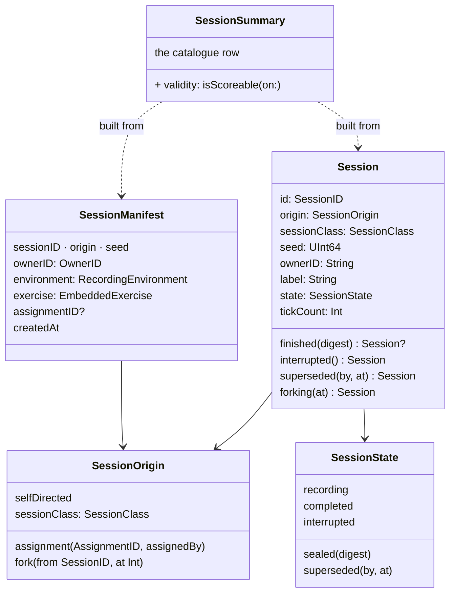
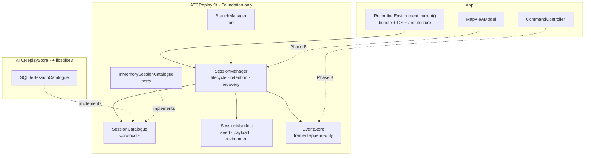

# Phase A — Foundations: implementation report

**Scope:** wire `ATCReplayKit` into the project; `SessionManifest`; SQLite session catalogue;
`SessionManager`; `BranchManager`.
**Behaviour change to the simulation: none.** Nothing in the app calls any of this yet.
**Tests:** ATCReplayKit 37 → **113**; app suite +2. All suites green.

> **⤷ Historical record.** A phase report from before the ReplayCore extraction (test counts and package
> shape have since moved on — the suite is now 175). The canonical current architecture is
> [`replay-adapter-boundary.md`](replay-adapter-boundary.md) +
> [`building-an-adapter.md`](building-an-adapter.md); the release overview is
> [`../release/replaycore-extraction.md`](../release/replaycore-extraction.md).

---

## 1. What changed and why

### 1.1 `ATCReplayKit` split into two targets

Not in the original plan. The catalogue is the one part of this work that genuinely wants a
database — it answers queries and wants transactions — but SQLite would tie the package to a platform
library, and the rest of it is Foundation-only precisely so it can carry a C interface and reach
React Native and Unity.

```
ATCReplayKit     Foundation only   Session · Event · EventStore · Manifest · managers
ATCReplayStore   + libsqlite3      SQLiteSessionCatalogue
```

`SessionCatalogue` is a protocol in the core; SQLite implements it in the store. Two dividends beyond
portability: the managers are tested against an in-memory catalogue rather than a temporary file (a
test that touches no disk does not fail for reasons of its own), and the app can choose.

### 1.2 The exercise payload is embedded as opaque bytes

The design said "embedded, not referenced". Implementation forced a sharper decision: the payload is
`ExerciseDetail`, an **app** type, and ATCReplayKit cannot depend on the app.

So the manifest stores it as `Data` plus a SHA-256 digest, and does not decode it. That is better than
a typed copy would have been:

- **Byte-exact.** A typed round trip could re-encode into something subtly different from what the
  backend served. The recording holds the actual bytes.
- **Cannot drift.** The payload's shape belongs to the app and changes with it; the manifest is
  unaffected.
- **Verifiable without decoding.** `payloadIsIntact` compares the digest, so a corrupted payload fails
  rather than replaying a subtly-wrong world.

### 1.3 `OwnerID` carries both kinds of identity

Per the answer to open question 1: the authenticated backend user id, or a device-scoped UUID when
nobody is signed in.

Modelled as an enum rather than a `String` plus a flag, so the distinction survives storage and can be
enforced: **an assessment requires an authenticated owner.** A device identity is nobody, and an
assessment needs someone to be about — `SessionManager.start` refuses it.

Storage form is prefixed (`user:…` / `device:…`) so the two spaces cannot collide.

### 1.4 The manifest is written twice

`manifest.json` and `manifest.json.bak`.

Losing a manifest is the **only unrecoverable failure** in this design: the seed is the root of the
whole reconstruction, so a corrupt manifest means a session that can never be replayed however intact
its events are. A few hundred duplicated bytes against that is not a trade worth thinking about.
`SessionManager.manifest(for:)` falls back to the backup, and a test deletes the primary to prove it.

### 1.5 Retention is a pure function

Per the answer to open question 4: configurable, unlimited by default, and no storage-format
implications.

`RetentionPolicy.evictable(from:now:)` takes summaries and returns what should go. Pure, so a policy
can be reasoned about and tested without a filesystem — and so a UI can show what a policy *would*
remove before it does. `evictable()` never deletes; `applyRetention()` does.

Two defaults worth stating because they are decisions, not conveniences:

- **Assessments are not swept by housekeeping** (`evictsAssessments = false`). Deleting a record about
  a person is an administrative act with its own audit trail, not something that happens because a
  device filled up.
- **A recording session is never evictable.** The recorder would be writing into a directory that no
  longer exists.

### 1.6 Assignments are optional, and uncoupled

Per the answer to open question 2. `SessionManifest.assignmentID` exists and is unpopulated; nothing
in Phase A needs the assignment API.

The field exists now on purpose: a recording made today can later be recognised as having had *no*
assignment, which is a different fact from the field not existing. Attaching one becomes additive.

---

## 2. What the tests found

Two real findings, both from tests written to hold two things to one rule.

### 2.1 The two catalogues disagreed about what may be updated

`SessionCatalogueContractTests` runs once against each implementation. It caught this immediately:
SQLite's `ON CONFLICT DO UPDATE SET` names its columns, so it silently refused to rewrite the seed —
while the in-memory version replaced the whole row and happily rewrote it.

Fixed by making the rule explicit in both, and the rule is worth stating:

| Mutable over a session's life | Fixed when recording starts |
|---|---|
| `state` (+ seal digest, superseded by/at) | `owner`, `session_class`, `seed` |
| `label` | `parent_id`, `fork_tick` |
| `tick_count` | `exercise_name`, `exercise_digest`, `assignment_id` |
| `storage_origin` | `schema_version`, `build_version`, `architecture` |

What a session *is* — which world it recorded, who it belongs to, what computed it — is settled at
`start`. Letting an update touch any of it would let a later write rewrite history with nothing
reporting it. `SessionSummary.updated(state:label:tickCount:origin:)` is the only way to change a row,
so this is enforced by the type rather than by care.

### 2.2 `verify.sh` was under-reporting

Unrelated to Phase A but found by it: the script read the **last** `Executed N tests` line, and
`swift test` prints one per suite as well as one overall, in no fixed order. It reported ATCReplayKit
as having 17 tests when it had 113. Now takes the maximum, and its failure check is anchored on the
word "failures" — the previous pattern matched the number in "with 14 tests skipped".

A verification script that under-reports is worse than none, so this is a small fix with a poor
failure mode.

---

## 3. Database schema — `catalogue.sqlite`

```sql
CREATE TABLE sessions (
    id              TEXT PRIMARY KEY NOT NULL,   -- session UUID
    owner_key       TEXT NOT NULL,               -- "user:<id>" | "device:<uuid>"
    session_class   TEXT NOT NULL,               -- "training" | "assessment"
    state           TEXT NOT NULL,               -- recording|completed|sealed|interrupted|superseded
    state_digest    TEXT,                        -- seal, when state = 'sealed'
    superseded_by   TEXT,                        -- child session id, when state = 'superseded'
    superseded_at   INTEGER,                     -- tick,             when state = 'superseded'
    label           TEXT NOT NULL DEFAULT '',
    parent_id       TEXT,                        -- lineage
    fork_tick       INTEGER,
    seed            TEXT NOT NULL,               -- UInt64 as decimal text — see below
    tick_count      INTEGER NOT NULL DEFAULT 0,
    created_at      REAL NOT NULL,               -- seconds since epoch
    exercise_name   TEXT,
    exercise_digest TEXT NOT NULL,               -- SHA-256 of the embedded payload
    assignment_id   TEXT,
    schema_version  INTEGER NOT NULL,
    build_version   TEXT NOT NULL,
    architecture    TEXT NOT NULL,
    storage_origin  TEXT NOT NULL DEFAULT 'local' -- "local" | "received"
);

CREATE INDEX sessions_owner  ON sessions (owner_key, created_at DESC);  -- "My sessions"
CREATE INDEX sessions_origin ON sessions (storage_origin, created_at DESC); -- "Shared with me"
CREATE INDEX sessions_parent ON sessions (parent_id);                   -- branch tree

PRAGMA journal_mode = WAL;
PRAGMA synchronous  = FULL;
PRAGMA user_version = 1;
```

**`seed` is TEXT.** SQLite integers are signed 64-bit; a seed is unsigned 64-bit, so half the seed
space would round-trip as a negative number. A seed that comes back wrong is a session that can never
be replayed. `testASeedInTheTopHalfOfTheRangeSurvives` pins it with `UInt64.max`.

**State is three columns, not one.** `.sealed` carries a digest and `.superseded` carries a child and a
tick. Encoding them into one string would make them unqueryable and would put a parser in the storage
layer.

**`synchronous = FULL`.** The catalogue is an index and rebuildable from manifests in principle, but a
torn write loses the *list* of what exists — a poor thing to have to rebuild by scanning directories
at launch.

**Migrations are append-only.** `SELECT *` maps columns by position, so a column inserted in the middle
would misread every existing row. New columns go on the end, which is also what keeps old databases
readable.

---

## 4. Manifest schema — `manifest.json`

Pretty-printed with sorted keys: readable with `cat`, and byte-stable so a seal computed over it means
something.

```json
{
  "assignmentID" : null,
  "createdAt" : "2026-08-03T14:22:31Z",
  "environment" : {
    "architecture" : "arm64",
    "buildVersion" : "1.4.2 (317)",
    "platform" : "iOS 26.3",
    "schemaVersion" : 1
  },
  "exercise" : {
    "digest" : "9f2b…",
    "exerciseID" : "ex-1",
    "exerciseName" : "Delhi approach",
    "payload" : "<base64 of the bytes the backend served>"
  },
  "origin" : { "kind" : "selfDirected" },
  "ownerID" : { "user" : { "_0" : "auth0|abc123" } },
  "seed" : 11189196,
  "sessionClass" : "training",
  "sessionID" : "5E2A…"
}
```

`origin` is one of:

```json
{ "kind": "selfDirected" }
{ "kind": "assignment", "assignmentID": "…", "assignedBy": "instructor-1" }
{ "kind": "fork", "parentID": "…", "forkTick": 900 }
```

Written once at `start`, **never mutated**. Everything that changes lives in the catalogue.

---

## 5. Session / branch data model



**`sessionClass` is derived from `origin` and never chosen.** `selfDirected` and `fork` are always
`.training`; `assignment` is always `.assessment`. That is option A enforced by the type: if a trainee
could declare a session an assessment they could also decline to share a bad one, and an instructor's
list would be a self-selected portfolio rather than a record.

**A fork is metadata.** Parent id, fork tick, a new event log. Nothing copied — that is the dividend of
recording causes rather than state. `BranchManager` is the shortest file in the package for that
reason.

**The parent's future is kept.** It is marked `.superseded(by:at:)`, not truncated. Comparing the first
run against the second is the entire value of branching, and
`testTheParentIsSupersededButItsEventsAreKept` pins it.

### 5.1 On-disk layout

```
<Application Support>/Sessions/
  catalogue.sqlite
  <sessionID>/
    manifest.json          written once, never mutated
    manifest.json.bak      the only unrecoverable loss, so it is written twice
    events.log             append-only framed log (Phase B)
    snapshots/             later; a cache, safe to delete
```

---

## 6. Updated architecture diagram

Only one thing changed from the approved design — the target split — so this shows Phase A's shape
rather than restating the whole system.



The dotted arrows are Phase B. Today nothing in the app calls any of it, which is what "zero
behavioural change" means — and why `ReplayKitWiringTests` exists: a package that builds in isolation
but is not actually linked would look identical until Phase B tried to use it.

---

## 7. Files added

| File | Purpose |
|---|---|
| `ATCReplayKit/SessionManifest.swift` | manifest, `OwnerID`, `RecordingEnvironment`, `EmbeddedExercise`, origin coding |
| `ATCReplayKit/Digest.swift` | SHA-256 seam over CryptoKit |
| `ATCReplayKit/SessionCatalogue.swift` | protocol, `SessionSummary` + validity, in-memory implementation |
| `ATCReplayKit/SessionManager.swift` | lifecycle, layout, recovery, `RetentionPolicy` |
| `ATCReplayKit/BranchManager.swift` | fork, lineage, descendants |
| `ATCReplayStore/SQLiteSessionCatalogue.swift` | the SQL implementation |
| `VectraPro/Commands/RecordingEnvironment+App.swift` | the app's build/OS/architecture answer |
| 4 test files | 76 new tests, including the shared catalogue contract |

`project.pbxproj`: `ATCReplayKit` and `ATCReplayStore` added to the app and test targets, mirroring
the ATCTrafficKit block so the pattern stays recognisable.

---

## 8. Honest limits of Phase A

- **Nothing is recorded yet.** No session is created by the app; `SessionManager` is exercised only by
  tests. That is by design, and it means Phase A cannot have broken the simulation.
- **The seal is computed by nobody.** `SessionState.sealed(digest:)` and `Session.finished(digest:)`
  accept one, and no code produces one — that belongs with recording, in Phase B, since the digest is
  over the manifest and the event log.
- **`ownerID` is not sourced from auth.** `OwnerID` supports both kinds; wiring it to the app's real
  session is Phase B, where a session is actually started.
- **Retention is never applied.** No caller invokes `applyRetention`.
- **`ATCReplayStore` uses `SELECT *`** and maps columns positionally. Safe under the append-only
  migration rule, and worth revisiting if the table ever needs restructuring.

---

## 9. Ready for Phase B

The gate stands: `testARecordedSessionReplaysToTheSameFingerprint` must pass before any
`ReplayEngine` work begins.

Phase B, in the order from the design doc:

1. Extract `CommandController.route` → `perform(code:callsign:slots:source:)` — pure extraction.
2. Point `CommandKeyboardHandler` at it. **The one behaviour change in Phase B:** the keypad gains
   named-point and `answeredFromAircraft` validation it currently lacks.
3. `InputGateway` + `SessionRecorder`; `perform` calls `submit`.
4. Remove `AircraftSpawner.shared`; add `State` + `restore`.
5. `MapViewModel` starts and ends a session; recovery on launch.
6. The gate.
