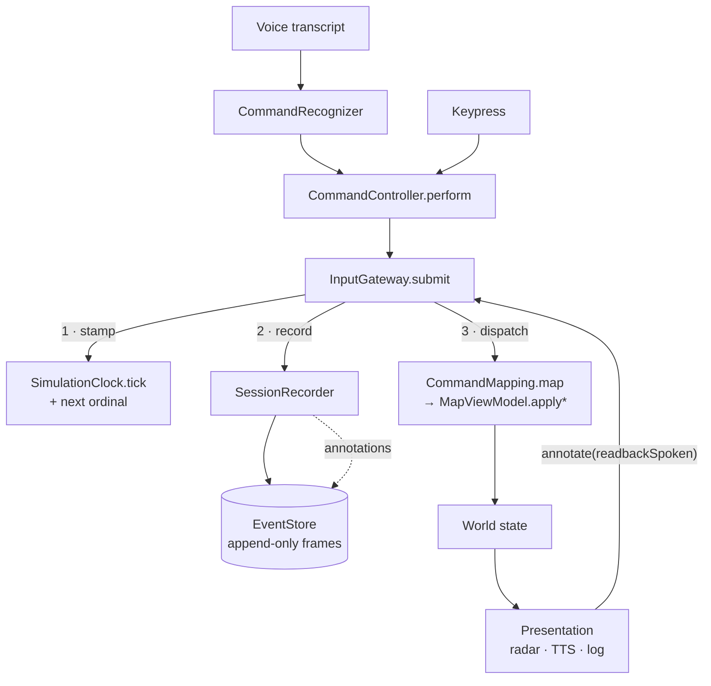
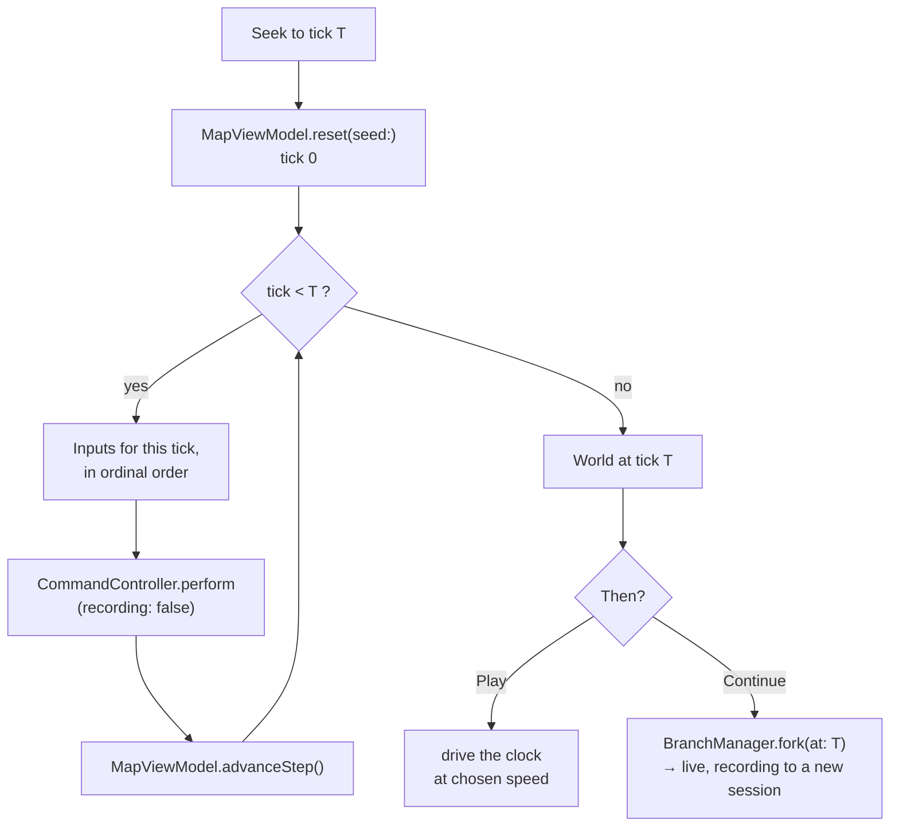
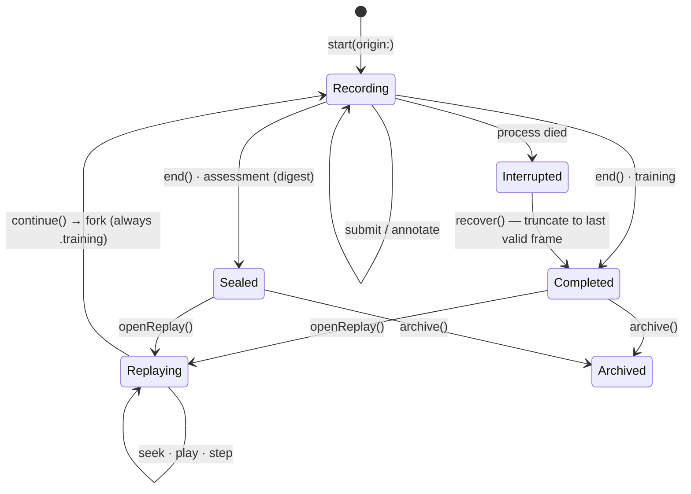
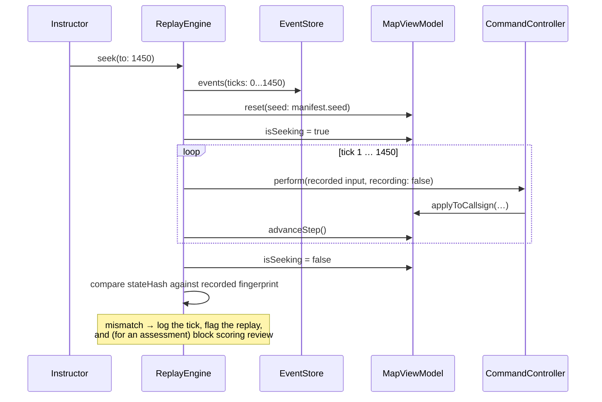

# Recording & Replay — Detailed Design (Phases B and C)

**Status:** proposal, for approval before implementation.
**Companion to:** [`replay-engine.md`](replay-engine.md), which sets out *why*. This sets out *what
and where*, at the level of types and call sites.
**Date:** 2026-08-03

> **⤷ Historical record — a pre-extraction design.** The types sketched below predate the R2b-atomic
> vocabulary move: `EventPayload` / `EventKind` were replaced by `EventBody` / `EventTypeTag`, and the ATC
> vocabulary now lives in `ATCReplayAdapter`. For the final architecture see
> [`replay-adapter-boundary.md`](replay-adapter-boundary.md) and
> [`building-an-adapter.md`](building-an-adapter.md); for the release overview,
> [`../release/replaycore-extraction.md`](../release/replaycore-extraction.md).

---

## 0. The finding that shapes this design

I read the whole command path before designing, and the seam I expected to use is the wrong one.

There are exactly **three** places where an input reaches the simulation today:

| | Call site | Reaches |
|---|---|---|
| 1 | `CommandController.apply` | `MapViewModel.applyToCallsign(_:commands:readback:)` |
| 2 | `CommandController.apply` | `MapViewModel.apply(_:readback:)` — selected aircraft |
| 3 | `CommandKeyboardHandler.apply` | `MapViewModel.apply(_:readback:)` — selected aircraft |

Two funnels, so `MapViewModel.apply*` looks like the obvious recording point. **It is not.** Both
funnels take `[AircraftCommand]` — *already-mapped effects*. By the time an input arrives there, the
phraseology code has been thrown away, and the code is the only thing worth recording (§5.1 of the
companion: recording derived commands freezes yesterday's mapping bug into every session).

So the gateway must sit **upstream of the mapping**, where `code` and `slots` still exist. That is a
new seam, and creating it pays for itself twice over:

- `CommandMapping.map(code:slots:)` is currently called from **two** places —
  `CommandController.route` and `CommandKeyboardHandler.apply` — with the surrounding
  validate/readback/apply logic duplicated between them, unequally. Voice checks named points and
  `answeredFromAircraft`; the keyboard checks neither. Unifying them behind one entry point removes
  that divergence.
- **The keyboard path is already proof that `code` + `slots` is sufficient to drive the simulation.**
  A keypress has nothing else — it builds `StaticCommandSlots` and maps. Which means replay is not a
  new execution path at all: **replay is the keyboard path, with recorded values.**

That last point is the load-bearing insight of this design. Replay does not re-implement anything.

---

## 1. InputGateway

### 1.1 What it is

One choke point that every simulation input passes through. It stamps ordering, records, and
dispatches — in that order, so nothing can execute without having been recorded first.

```swift
/// An input the simulation can act on, in the form worth recording: what was asked, of whom, with
/// what values. Deliberately *not* [AircraftCommand] — that is derived, and a fix to the derivation
/// should reach old recordings rather than being frozen into them.
struct SimulationInput {
    let code: String                    // phraseology abbreviationCode
    let callsign: String?               // resolved aircraft callsign, nil = selected aircraft
    let slots: [String: String]         // template slot name → value, as text
    let source: InputSource             // .voice | .keyboard | .instructor
}

/// What the gateway did with it.
struct InputReceipt {
    let position: EventPosition         // (tick, ordinal) — assigned here, nowhere else
    let wasRecorded: Bool               // false when no session is recording
}
```

### 1.2 Ordering

`ordinal` is a monotonic `UInt32` assigned by the gateway and nothing else. That is the whole reason
it is gap-free and race-free: one counter, one owner, one actor.

`tick` comes from `SimulationClock`. **`tick` alone is never a key** — one transmission routinely
carries three instructions, so three inputs share a tick. `(tick, ordinal)` is the total order, and
`EventPosition` already implements `Comparable` on exactly that pair.

### 1.3 API

```swift
@MainActor
final class InputGateway {

    /// Where recorded inputs go. Nil when nothing is recording — the gateway still stamps and
    /// dispatches, so recording is genuinely optional and the app behaves identically without it.
    var recorder: SessionRecorder?

    /// Stamp, record, dispatch. In that order: an input that could not be recorded must not execute,
    /// or the recording no longer explains the session.
    @discardableResult
    func submit(_ input: SimulationInput) -> InputReceipt

    /// Facts worth keeping that are not inputs — a transcript, a readback, a rejection, a score.
    /// Recorded, never dispatched.
    func annotate(_ payload: EventPayload)

    /// Replay feeds recorded inputs back through here, which does *not* re-record them.
    func replay(_ input: SimulationInput, at position: EventPosition)
}
```

`annotate` matters more than it looks: it is what keeps the record complete without letting
presentation into the simulation. A readback is recorded because it is a thing the trainee heard, and
dispatched to nothing.

### 1.4 Every input, and where it enters

| Input | Enters via | Recorded as |
|---|---|---|
| Voice command | `CommandController.process` → recognize → `perform` → `submit` | `commandIssued` |
| Keyboard command | `CommandKeyboardHandler.apply` → `perform` → `submit` | `commandIssued` |
| Raw transcript | `CommandController.process` → `annotate` | `transcriptReceived` |
| Readback spoken | `CommandController` / handler → `annotate` | `readbackSpoken` |
| Refusal (bad value, unknown point, unmapped code) | the same, → `annotate` | `commandRejected` |
| Weather change (scripted/instructor) | `MapViewModel` → `submit` | `weatherChanged` |
| Score evaluation | scoring → `annotate` | `scoreEvaluated` |
| Pause / resume / speed / seek | `MapViewModel` / replay UI → `annotate` | `timelineAction` |
| **Spawn, promotion, hold capture, collision, landing** | **nothing — derived** | not recorded |

That last row is the design in one line. Those are *consequences*, recomputed by re-running the
simulation from the seed. Recording them would create a second version of the truth that can disagree
with the simulation.

### 1.5 The refactor that creates the seam

Extract from `CommandController.route(_:callsign:)` everything after recognition into one method that
both the keyboard and replay can call:

```swift
extension CommandController {
    /// The one path from phraseology to effect. Live voice, the keypad, and replay all arrive here.
    func perform(code: String,
                 callsign: String?,
                 slots: some CommandSlots,
                 source: InputSource,
                 recording: Bool = true) -> PerformOutcome
}
```

`CommandSlots` already exists in ATCSimKit as a protocol, with `StaticCommandSlots` as its
value-based implementation and `RecognizedCommand` conforming retroactively. So voice passes the
recognised command, the keyboard passes `StaticCommandSlots`, and **replay passes
`StaticCommandSlots` built from recorded slots** — no new abstraction, no third code path.

**Correction (found while implementing step 1).** I claimed here that the keypad was missing validation
the voice path performs, and that unifying would fix a live bug. Checked against the actual bindings,
**that is not reachable today**:

- All fourteen bound keys carry integer slots only — speeds, levels, headings, turns — so there is no
  `.fix` slot for named-point validation to look at. The check would be a no-op.
- None of the bound codes is in `CommandMapping.answeredFromAircraft` (216, 258, 409, 430, 443), so no
  key asks the simulator to answer a question about an aircraft.
- Every bound key maps to real effects and so goes through `MapViewModel.apply(_:readback:)`, which
  already refuses when nothing is selected.

So step 1 has no bug to fix, and inventing one would be worse than saying so. What it does instead is
**pin the current behaviour**, so unification is either provably neutral or shows up as a failure — which
is the protection that was actually wanted. Plus one test that fails the day a key *is* bound to a code
needing either check, so the gap becomes real the moment it becomes reachable rather than shipping
unnoticed.

---

## 2. Event model

Already implemented (`ATCReplayKit/Event.swift`, 37 tests). Restated here as the contract, with the
parts Phase B and C add.

### 2.1 Types

```
EventPosition   (tick: Int, ordinal: UInt32)   Comparable on the pair
Event           position, payload, wallClock?
EventKind       stable UInt16 discriminator — never renumbered
EventPayload    commandIssued · commandRejected · transcriptReceived · readbackSpoken
                weatherChanged · scoreEvaluated · timelineAction
```

`EventPayload.affectsSimulation` splits causes from annotations. Replay consumes the causes and may
skip the rest, which is what lets a seek run silently.

### 2.2 Timestamps

Two clocks, and the separation is enforced by naming:

- **`tick`** — simulated time. The only clock the simulation reads.
- **`wallClock`** — real time, optional, **audit only.** It answers "how long did the trainee take to
  respond", a genuine assessment question, while being structurally incapable of affecting a replay.
  The rule is greppable: *no code inside the simulation core may read `wallClock`.*

### 2.3 Versioning — implemented

Every stored event carries **three** numbers, because they change at different rates and for
unrelated reasons:

```json
{ "schemaVersion": 1,      // the envelope's own structure
  "eventType": 1,          // which kind
  "eventVersion": 1,       // which version of *that kind's* payload
  "tick": 42, "ordinal": 17, "wallClock": 1764792151.4,
  "payload": { … } }
```

And the **manifest is versioned separately again** (`SessionManifest.manifestVersion`). Adding a field
to the manifest has nothing to do with adding one to a command event; a single shared number would
make every unrelated change look like a compatibility break everywhere.

- `tick` and `ordinal` live in the **envelope**, not the payload, so a log can be ordered and indexed
  without interpreting — or being able to interpret — a payload a newer build wrote.
- New payload cases are appended; `EventKind` numbers are never reused.
- New fields are optional, and absent means "was not recorded" — never a default that looks real.
- `Codable` is hand-written, because the synthesised form keys on Swift *parameter names* and a
  rename with no intent behind it would silently stop old recordings decoding.
- A schema, event version or manifest version above this build's is **refused with a specific
  error**, not opened optimistically.

**Migrations operate on dictionaries, not types.** A migration's job is to adapt a shape the current
types cannot express; typed migrations would mean keeping `CommandIssuedV1`, `V2`, `V3`… as Swift
types forever. `EventMigration` steps are single-version (`N → N+1`), so a gap in the chain is a
loud, specific error rather than a silent partial migration, and `EventMigrator` runs the chain **on
read**. Nothing rewrites a stored recording — the bytes stay exactly as written, which is what keeps
a seal over them meaningful.

The registry is empty today. That is the point: the first field ever added is a one-line
registration, not a redesign. A synthetic migration in `EventSchemaTests` proves the chain works
before anything needs it.

### 2.5 Event identity — `eventID`

Every recorded event has a stable identity, so that bookmarks, instructor annotations, analytics and
cloud sync can all refer to *one specific event* and keep referring to it.

**Ordering never uses it.** Ordering is `(tick, ordinal)`, full stop. The id is deliberately opaque so
that nothing can be tempted to sort by it — which is also why it is not, say, a zero-padded ordinal.

#### Generation

```
eventID = UUIDv8( SHA256( sessionID.bytes ‖ "evt" ‖ ordinal.littleEndian ) [0..<16] )
```

- **`sessionID`** — a UUID, so it carries ~122 bits of entropy. Two events in different sessions can
  only collide if their sessions did.
- **`ordinal`** — unique within a session by construction: one counter, one owner (`InputGateway`).
- **`"evt"`** — a domain separator, so this hash space cannot collide with any other thing we later
  derive from a session id (a snapshot id, a chunk id).
- **UUIDv8** (RFC 9562, "custom") with the version and variant nibbles set. Not v4 — it is not random
  — and not v5 — that is specified as SHA-1. Claiming v8 says truthfully "derived, by a scheme of our
  own".

#### `tick` is deliberately *not* part of it

`ordinal` alone identifies an event within a session. Mixing in `tick` would be redundant, and worse:
it would tie identity to a value that a future feature might legitimately re-stamp (a repaired
recording, a re-based branch). An annotation must not lose its anchor because a tick was corrected.

#### The payload is deliberately *not* part of it

A content hash would be attractive for deduplication, and is wrong here. Payloads are **migrated on
read** (§2.3), so an id derived from content would change the moment a migration touched the event —
silently orphaning every annotation that pointed at it. Identity has to survive the shape changing,
which means it can only be derived from things that never change.

#### Derived, not stored

The id is **computed**, not written into the log. `Event.id(in:)` takes the session id and returns it.

- **It cannot disagree with its position.** A stored id could be corrupted or copied wrong; a derived
  one is always exactly what `(sessionID, ordinal)` implies.
- **It costs no bytes.** ~1,000 events a session, 16 bytes each, is not much — but it is not nothing,
  and there is nothing to buy with it.
- **The scheme stays cheap to change.** Nothing on disk encodes it, so revising this decision is a
  code change rather than a migration. Worth saying plainly: if this strategy is wrong, we can replace
  it without touching a single recording.

The cost of deriving: an `Event` alone cannot name itself — it needs its session. That is honest
rather than inconvenient, since a per-session ordinal is meaningless without knowing the session, and
anything carrying events across a boundary (sync, export) carries the session id anyway.

#### One implementation requirement this creates

Uniqueness rests entirely on `ordinal` never repeating within a session. So after a crash, when
recording resumes on the same log, **the gateway's counter must be seeded from
`EventStore.lastPosition`** rather than restarting at 1. `EventStore` already refuses a non-increasing
append, so a mistake here fails loudly at the first event rather than quietly minting a duplicate id —
but the seeding is a requirement of this scheme, not an incidental detail.

#### What it enables, and what it does not

| Use | How |
|---|---|
| Bookmarks, annotations | foreign key `(sessionID, eventID)` in the catalogue, outside the sealed log |
| Deduplication on sync | same session + same ordinal ⇒ same id ⇒ the same event, whatever its payload version |
| Analytics references | a stable handle that survives migrations and re-reads |
| Cross-session debugging | ids are unique across sessions, so two lineages can be compared in one view |
| **Ordering** | **never** — use `(tick, ordinal)` |
| Content equality | never — two events with the same id are the same *event*, not necessarily the same *bytes*, since the payload may have been migrated |

### 2.6 Event source attribution — `EventSource`

Every event carries where it came from, in the **envelope** — so it can be filtered without decoding a
payload a newer build wrote, for the same reason `tick` and `ordinal` live there.

Known values: `voice`, `keypad`, `ai`, `system`, `instructor`, `replay`, `network`, `automation`, and
`unspecified` for a recording that predates the field.

**A struct with named constants, not an enum.** An enum reads better and is wrong for a stored format:
decoding one requires every value to be known, so a recording written by a newer build — one that had
learned a source this build has not — would fail to decode *entirely*, losing events over a field
nobody was reading. The extensible-constant pattern (as `Notification.Name` uses) decodes anything,
preserves unknown values through a round trip, and reports `isKnown` so a diagnostic can say "3 events
from a source this version does not recognise" rather than silently miscategorising them.

**Adding a source never touches a recording, and never stops one being read.** `network` and `replay`
exist before multiplayer and replay diagnostics do, precisely so that when they arrive nothing written
earlier needs changing. A test asserts they are already there.

Three groupings, and the third has a consequence rather than an insight:

| | |
|---|---|
| `isHuman` | voice, keypad, instructor |
| `isSynthetic` | ai, system, replay, automation |
| `isAttributableToTrainee` | **voice, keypad only** — an assessment must not credit or blame a trainee for an instruction an instructor injected |

An unrecognised source is neither human nor synthetic, which is the honest answer for something that
cannot be classified.

**Attribution is not identity.** `EventSource` is deliberately outside the `eventID` derivation: two
events differing only in source are the same event, and an annotation must not move because attribution
was corrected.

Mapping, as recording will use it:

| Event | Source |
|---|---|
| spoken command, transcript | `voice` |
| keypad command | `keypad` |
| readback spoken, score evaluated | `system` |
| instructor injection | `instructor` |
| refusal | whatever the input's source was |
| weather from the seed / from an instructor | `system` / `instructor` |
| timeline action | whoever performed it; `system` when the app initiates (auto-pause on backgrounding) |

### 2.7 Correlation and causation — reserved

Two optional envelope fields, **present in the format and unpopulated**:

| Field | Meaning |
|---|---|
| `correlationID` | the `eventID` of whatever started the chain this event belongs to |
| `causationID` | the `eventID` of the event that *directly* caused this one |

One transmission produces several events — a transcript, two or three commands, a readback. They share a
correlation, so "everything that came of that instruction" becomes one query rather than a reconstruction
from ticks and guesswork. `causationID` names the immediate parent, so a chain can be walked as a tree
rather than only as a set; an AI decision chain and a command's consequences are both trees, and
flattening them loses the part worth debugging.

**`EventID`s, not bare ordinals.** A chain can legitimately cross sessions: a fork continues its parent's
world, so an event in a branch may name a cause in the session it forked from. An ordinal could not
express that.

**Never for ordering, never for replay.** A replay consulting these would be deriving causality from a
hint instead of from the simulation. Ordering stays `(tick, ordinal)`.

**Outside identity.** Two events differing only in their chain are the same event, so an annotation cannot
move because tracing was added or corrected — the same rule that excluded payload, tick and source.

They are added now rather than deferred for one reason: it makes "optional and additive" a *demonstrated*
property rather than a claim. `EventTracingTests` proves an event without them still decodes, that absent
fields cost no bytes, and that a malformed one loses the hint rather than the event. The alternative was
discovering in Phase C that they could not be added without a migration.

### 2.4 What Phase C adds

Nothing to the model. Replay reads what recording wrote. If Phase C needs a new payload case, the
recording side was incomplete and that is the bug to fix.

---

## 3. Recording pipeline



### 3.1 Order is the contract

**Stamp, record, dispatch.** An input that cannot be recorded must not execute — otherwise the
session contains a command the recording does not explain, and the replay diverges with no
explanation.

Consequence: if the store throws, the input is **refused and the controller is told**, exactly like an
illegal value. Silent degradation is the one outcome that is not acceptable here, because the failure
surfaces weeks later as an unexplainable replay.

### 3.2 Durability

Driven off `SessionClass`, decided once at session open, not at each call site:

| | training | assessment |
|---|---|---|
| Flush | batched (~1 s or N events) | **every event, `fsync`** |
| On completion | `.completed` | `.sealed(digest:)` |
| Crash → | `.interrupted`, replayable | `.interrupted`, **unscoreable** |

Already implemented and tested in `EventStore`.

### 3.3 Off the hot path

`SessionRecorder` copies and returns; encoding and I/O happen on a serial background queue for
training. For an assessment the flush is synchronous by design — at ~1,000 events a session the I/O
is a rounding error, so there is no trade to make.

**Backpressure policy:** drop snapshots (they are a cache), never drop events (they are the truth). If
events cannot be written, mark the session degraded and tell the user.

---

## 4. Replay pipeline



### 4.1 Seek

```
seek(to: T):
    if T > current and (T - current) small     → step forward, feeding inputs
    else                                       → reset(seed:) and re-simulate 0 → T
```

No snapshots in Phase C, and that is a measured decision rather than a shortcut: Phase 0 measured
**~16 µs per tick**, so re-simulating a full 40-minute session costs **~38 ms**. Seek is fast enough
without them. §7 defines the snapshot shape anyway, so adding them later is additive.

### 4.2 Presentation is suppressed while seeking

A seek through 400 ticks must not queue 40 readbacks. `isSeeking` is a flag the presentation layer
honours **structurally** — one check in `CommandFeedbackManager` and one in
`DeferredReportCoordinator` — not per-call-site discipline, which decays.

### 4.3 Reverse

Deferred to a later phase, and its shape is fixed now so nothing has to be undone: reverse is
`seek(T-1)` with a ring buffer of the `K` most recent Worlds. There is no inverse step and there will
not be one — collision destruction, spawning and hold capture destroy information, so an `unstep`
would be a second physics implementation obliged to agree with the first.

---

## 5. Determinism guarantees

What Phase 0 established, and what Phases B and C must not break:

| Guarantee | Enforced by |
|---|---|
| One simulated second per step, always | `SimulationClock`; speed changes the timer period only |
| **No real clock in the simulation** | two source scans — `WallClockScanTests` (ATCSimKit) and `DeterministicTimeTests` (app) — plus `DeterminismTests`, which inserts a real pause between steps and asserts the outcome is unchanged |
| Exactly one timer drives the loop | `testExactlyOneFileDrivesTheSimulationFromATimer` |
| Randomness reproducible from one seed | `RandomStreams`, one stream per subsystem |
| Adding a draw in one subsystem cannot disturb another | separate streams; `testDrawingFromOneStreamDoesNotDisturbAnother` |
| Identity survives a restore | `Aircraft.id` is an init parameter |
| Cross-architecture agreement | `DeterminismSelfCheck`, measured identical on arm64 and x86_64; runs in CI |
| Cross-process agreement | golden fingerprint pinned in `DeterminismTests` |
| No `Set`/`Dictionary` iteration order affects state | rule + sorting at the two current sites; the golden fingerprint is what would catch a violation |

**Phase B adds one guarantee:** re-running a recorded session reproduces its fingerprint.

```swift
// The acceptance test for Phase B, and the thing that validates the architecture before
// ReplayEngine is written:
func testARecordedSessionReplaysToTheSameFingerprint()
```

That test is the gate. **ReplayEngine implementation does not start until it passes**, because until
it does, we do not know that the recording contains enough to reproduce the run — and finding that
out after building the engine would mean rebuilding it.

---

## 6. AircraftSpawner refactor

### 6.1 Why it must change

Two defects, both found by Phase 0 rather than by reading:

1. **Mutable state on a singleton.** `radialCycle` (a shuffled list) and `radialCycleIndex` live on
   `AircraftSpawner.shared`. Two simulations sharing it draw from each other's cycle, so neither is
   reproducible. Tests already work around this by constructing their own.
2. **An isolated deinit that aborted the process** when an instance was released — invisible while it
   was only ever a singleton, and fixed in Phase 0 with `nonisolated deinit`.

### 6.2 The change

- Remove `AircraftSpawner.shared`. `MapViewModel` owns one, constructed with it.
- Make `init()` the only way to get one (already done).
- Make the cycle state **inspectable and restorable**, because it is part of the simulation:

```swift
extension AircraftSpawner {
    /// The spawner's simulation state.
    struct State: Equatable, Codable, Sendable {
        /// The shuffled cycle as *indices into the radial list derived from the exercise fixes*,
        /// not the radials themselves. The list is a deterministic function of the fixes, so storing
        /// a permutation of indices keeps a snapshot compact and cannot disagree with the exercise.
        let cycleOrder: [Int]
        /// How far through the cycle the exercise has got.
        let cycleIndex: Int
    }
    var state: State { get }
    func restore(_ state: State, fixes: [ExerciseDetail.Fix])
}
```

### 6.3 Exactly what must be serialized

For Phase C-with-snapshots, the full list — and it is worth being exhaustive, because a field omitted
here is a field that silently resets on seek:

**Must be serialized**

| Owner | State |
|---|---|
| `SimulationClock` | `tick` |
| `RandomStreams` | `seed` + the `state` of every stream (spawner, promotion, traffic, weather) |
| `AircraftSpawner` | `cycleOrder`, `cycleIndex` |
| `MapViewModel` | `aircraft`, `traffic` (each `Aircraft` **minus `history`**) |
| | `destroyedAircraftIDs`, **and `wreckageDueTick`** — the removal schedule, or wrecks never clear |
| | `selectedAircraftID` |
| | `elapsedSeconds` (derived from clock, but published) |
| `TrafficSchedule` | per-category `remaining`, `countdown`, `fixedInterval` |
| `RadarPromotionSchedule` | `countdown` |
| `PendingReportTracker` | every outstanding report and its condition |
| Exercise config | already in the manifest; not repeated per snapshot |

**Must NOT be serialized**

| State | Why |
|---|---|
| `Aircraft.history` | derived trail, ~8 KB/aircraft — larger than all its other fields combined |
| conflict/warning/sequencing ID sets | pure functions of positions, recomputed every tick |
| `zoneShapes` cache | derived from the exercise |
| label offsets, collider sizes | presentation |
| anything in the UI — zoom, pan, layers, menus | no simulation effect |

**Guarded by a test, not by care:** a round-trip equality test plus a reflection check that every
stored property of `Aircraft` is covered, so adding a field without persisting it fails the build
rather than surfacing as a mysteriously resetting aircraft.

---

## 7. Snapshot strategy

**Not implemented in Phase C.** Defined now so it is additive later.

```swift
protocol SnapshotStore {
    func write(_ snapshot: WorldSnapshot) throws
    func nearest(atOrBefore tick: Int) throws -> WorldSnapshot?
    func evict(before tick: Int) throws
}
```

- **Interval:** 60 ticks (one simulated minute) to start; adaptive on a cost budget later, plus
  event-anchored snapshots before significant events, since those are what an instructor scrubs to.
- **Contents:** §6.3's "must be serialized" list, complete.
- **Full, not incremental.** A chain turns a cache miss into cascading loss, and restoring a chain is
  the same work as re-simulating but with more code. Delta recording already exists here — it is the
  event stream.
- **Format:** deterministic binary, `Float64` positions (`Float32` loses ~1 m, unacceptable against a
  1 NM capture radius), LZFSE compressed.
- **They are a cache.** Stamped with schema + build version; on mismatch, discard and re-derive.
  Snapshots never need a migration path, which is exactly why they may use a compact brittle format
  while events may not.

---

## 8. Session and replay lifecycle



`Replaying → Recording` **always forks**; it never mutates the session being replayed. That invariant
is what makes it safe to hand a replay to a trainee: nothing they do while exploring can damage the
record of what they did.

`Sealed` is reachable only from `Recording`, never from `Interrupted` — a crashed assessment stays
unsealed and therefore incomplete, which is the honest outcome.

---

## 9. Sequence diagrams

### 9.1 Live simulation with recording

```mermaid
sequenceDiagram
    participant U as Controller
    participant CC as CommandController
    participant G as InputGateway
    participant R as SessionRecorder
    participant ES as EventStore
    participant VM as MapViewModel

    U->>CC: "air india 123 climb FL260"
    CC->>G: annotate(transcriptReceived)
    CC->>CC: recognize → code 101, slots [LEVEL:260]
    CC->>G: submit(code:101, callsign:AIC123, slots:…)
    G->>G: stamp (tick 42, ordinal 17)
    G->>R: record(commandIssued)
    R->>ES: append frame  ·  fsync if assessment
    G->>CC: receipt
    CC->>VM: applyToCallsign(AIC123, effects, readback)
    CC->>G: annotate(readbackSpoken)
    Note over VM: tick 43, 44, … advanceStep()<br/>spawns, captures, collisions — all derived, none recorded
```



### 9.2 Replay



### 9.3 Continue Simulation

```mermaid
sequenceDiagram
    participant T as Trainee
    participant RE as ReplayEngine
    participant BM as BranchManager
    participant SM as SessionManager
    participant G as InputGateway

    T->>RE: pause at 900, "Continue Simulation"
    RE->>BM: fork(session: A, at: 900)
    BM->>SM: create Session(origin: .fork(from: A, at: 900))
    Note over SM: always .training, even forking an assessment
    BM->>SM: mark A .superseded(by: B, at: 900) — A's events after 900 are kept
    BM->>G: recorder = SessionRecorder(B)
    BM->>RE: stop replaying; hand the World over live
    Note over G: the World is already correct —<br/>it was reached by simulating, not by restoring a picture
```

That last note is the point of the whole architecture. Continue Simulation has no state-restoration
step because there is nothing to restore: the World at tick 900 was produced by simulating to tick
900, so it is a live World already.

---

## 10. Managers — API and ownership

| Manager | Owns | Public API | Does **not** own |
|---|---|---|---|
| **`InputGateway`** | the ordinal counter; the record-then-dispatch order | `submit(_:)`, `annotate(_:)`, `replay(_:at:)`, `recorder` | interpreting inputs; simulation state |
| **`SessionRecorder`** | one session's writing: buffering, flush cadence, seal | `record(_:at:)`, `flush()`, `finish() -> Session`, `isDegraded` | what is true; deciding what to record |
| **`EventStore`** ✅ | the append-only log; framing; truncation recovery | `openForAppending()`, `append(_:)`, `readAll()`, `events(ticks:)`, `recover()`, `truncateToLastValidFrame()` | snapshots; replay policy |
| **`SessionCatalogue`** | the list: every session's metadata, lineage, share state | `sessions(ownerID:)`, `sharedWith(_:)`, `upsert(_:)`, `session(id:)` | event or snapshot bytes |
| **`SessionManager`** | lifecycle and identity | `start(origin:seed:exercise:)`, `end(digest:)`, `recoverInterrupted()`, `open(id:)` | timeline mechanics |
| **`BranchManager`** | forking | `fork(_:at:) -> Session` | copying state — there is none to copy |
| **`ReplayEngine`** (Phase C) | seek, play, pause, speed, step; `isSeeking` | `seek(to:)`, `play()`, `pause()`, `stepForward()`, `setSpeed(_:)`, `continueLive()` | recording — it is off during replay |
| **`SnapshotStore`** (later) | keyframes | `write(_:)`, `nearest(atOrBefore:)`, `evict(before:)` | being authoritative |

Deliberately absent: a `StateSerializer` with authority over every subsystem. Serialisation is a
capability each type has next to its own definition; a serializer that knows every field becomes the
most-edited file in the project and the place every schema bug lives.

---

## 11. Migration plan

Ordered so each step ships and nothing needs undoing. Every step keeps the app working with recording
switched off.

### Phase A — foundations *(no behaviour change)*

1. Wire `ATCReplayKit` into `project.pbxproj` (app + test targets).
2. `SessionManifest` — seed, **resolved exercise payload** (embedded, never a reference: if the
   backend changes, a replay of a fetched payload is a different world with no error anywhere),
   schema/build/architecture versions, seal. Written once at session start; never mutated.
3. `SessionCatalogue` over SQLite — session rows, lineage, share state, validity badges.
4. `SessionManager` + `BranchManager`, tested against the catalogue with no simulation involved.

*Risk: none. Nothing calls it yet.*

### Phase B — live recording

5. **Refactor `CommandController.route` → `perform(code:callsign:slots:source:)`.** Pure extraction,
   no new behaviour, existing tests must stay green.
6. **Point `CommandKeyboardHandler` at `perform`.** This is the one step with a behaviour change: the
   keypad gains named-point and `answeredFromAircraft` validation. Needs its own tests.
7. `InputGateway`, `SessionRecorder`; `perform` calls `submit`.
8. Remove `AircraftSpawner.shared`; `MapViewModel` owns one; add `State` + `restore`.
9. `MapViewModel` starts/stops a session around `reset()`/exercise end; recovery on launch.
10. **Acceptance:** `testARecordedSessionReplaysToTheSameFingerprint` — record a scripted session,
    then re-run it from its seed and events and compare fingerprints tick by tick.

*Risk: step 6 changes keypad behaviour. Steps 5 and 8 are mechanical but touch the command path, so
`MapViewModelCommandTests` and `KeyboardCommandTests` are the safety net and must not be weakened to
accommodate them.*

### Phase C — replay *(only after step 10 passes)*

11. `ReplayEngine`: `reset(seed:)` + feed + `advanceStep()`; `seek`, `play`, `pause`, `stepForward`.
12. Structural `isSeeking` suppression in feedback and deferred reports.
13. `BranchManager.fork` wired to Continue Simulation.
14. Timeline UI: scrubber, transport, event markers.
15. Divergence reporting: compare fingerprints during replay; block scoring review on mismatch.

### Later

16. Snapshots (§7) — additive, shape already defined.
17. Reverse playback + ring buffer.
18. Sharing, annotations, seals submitted to the backend.

### 11.1 What could still force a refactor, and why I think it will not

Being explicit about the risk the brief is trying to avoid:

| Risk | Mitigation |
|---|---|
| Recording turns out to be missing something replay needs | That is exactly what step 10 tests, **before** the engine exists. If it fails, the fix is in the event model, which is cheap. |
| The event format needs to change after sessions exist | `schemaVersion` + additive-only rules + upcast on read. Snapshots need no migration because they are a cache. |
| `perform` cannot serve all three callers | The keyboard already proves `code` + `slots` is sufficient; `CommandSlots` already abstracts the difference. |
| Snapshots later force a different World shape | §6.3 fixes the serialized state now, and the round-trip test lands with it. |
| Determinism decays as features land | Golden fingerprint + self-check in CI, already running. |

---

## 12. Open questions

1. **Where does `ownerID` come from?** `SessionCatalogue` needs a stable user identity. The app has
   `Session`/auth — is there a stable user id to use, or does this need one adding?
2. **Assignments** (§22.2 option A, now chosen) need a backend concept: an instructor issues one, the
   app lists it, completing it shares implicitly. What does that API look like?
3. **Score rules versioning.** `scoreEvaluated` records a `rulesVersion`; scoring rules must become
   versioned and immutable once shipped, or the recorded score has nothing to reproduce against. Is
   scoring specified anywhere yet?
4. **Retention.** How many sessions per device, and who may delete an assessment? Deletion is not a
   replay-UI button.
